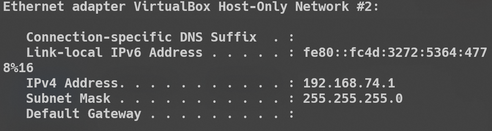

# Creating virtual mashine in Oracle VM VirtualBox Software
## Guid How to work with Oracle VirtualBox
In this guid i'll show how  to :
- create VM in Virtual Box and from CLI
- clone VM , snapshots
- network confiuration , DHCP, NAT,port forfradig
- working with Vagrand Software
- ect.
- 
### Host machine configuration

IP configuration
[Screen IP Wi-Fi Adapter](images/Screenshot_1.png)
``` 
 IPv4 Address. . . . . . . . . . . : 192.168.88.129
   Subnet Mask . . . . . . . . . . . : 255.255.255.0
   Default Gateway . . . . . . . . . : 192.168.88.1
```

Virtual Box Network Adpter
```
 IPv4 Address. . . . . . . . . . . : 192.168.74.1
   Subnet Mask . . . . . . . . . . . : 255.255.255.0
   Default Gateway . . . . . . . . . :
```
About Host Machine
[Screen  host configuration](images/Screenshot_3.png)
` Get-ComputerInfo | Select-Object OSVersion,OSBuildNumber,CsUserName,CsDomain,WindowsProductName,WindowsVersion
`
## Networking
Before creating VM , create the NAT adapter **TestNetwork**

Usage DHCP, range 10.13.113.0/24 
Port forwardig from local 127.0.0.(any) 1022 to VM 22 port (for ssh connection) 

[Screen port forwarding](images/Screenshot_4.png)

## Create VM
Create VM in "New" menu 
Just seting text:
- Name VM-1
- Type Linux
- Version Ubuntu 64-bit
- RAM 1 GB
- Disk 10 GB
- Network NAT TestNetwork

[Screen VM-1 Network MAC Address and configuration](images/Screenshot_5.png)
After instaling **Ubuntu Server 20.04 LTS** and first runnig we got next:
- user name on machine : **d0s**
- machine name: **vm-1-hrebynakha**
- ip address : **10.13.113.4**

[Screen ip config on **vm-1-hrebynakha**](images/Screenshot_6.png)

Connect to machine via ssh
[Screen ssh d0s@127.0.0.4 -p 1022](images/Screenshot_7.png)

[Screen ip config on machine](images/Screenshot_8.png)

Also we create Desctop Ubutu version for testing
 configuration of this VM:
 - name vm : **VM-2**
 - hostname **vm-2-hrebynakha**
 - ip : **10.13.113.5**
 - 
### Cloning
Before cloning shutdown the machine
`sudo shutdown now`
And create a clone (Ctrl+O) with name **VM1-Clone**

After take a cloning we have some issues:
- name of machine stay old **vm-1-hrebybynakha**
- we get ip address from DHCP and we get **10.13.113.4** it's conflictig with the first machine

We can renew IP following command:
`sudo dhclient -r` and `sudo dhclient -v`
But after rebooting machine we got alse old IP address
This happens beacouse DHCP configured by **machine-id** and in our case we have the same **machine-id** in both VM

Resolution:
Remove th machine id:
```
echo -n > /etc/machine-id
rm /var/lib/dbus/machine-id
ln -s /etc/machine-id /var/lib/dbus/machine-id
```
Shutdown VM `sudo shutdown now`

and Create clone

after creating this clone we got new ip address:
**10.13.113.7**
[Screen ip config on machine](images/Screenshot_9.png)
VM Goup and Cloning result:
[Screen ip config on machine](images/Screenshot_10.png)

## Snapshots
For take a shnapshots usage the snapshots menu (Ctrl+Shift+T):
Create file snap.txt in the text shap1_test
[Screen snap1 file](images/Screenshot_11.png)
Take snapshot
Create the file snap2.txt with the text snap2_test
[Screen  snap 2 file](images/Screenshot_12.png)
We got the next snapshots tree:
[Screen snapshots tree](images/Screenshot_13.png)

Return to snapshot 1 with Clone function:
[Screen Clone-Snap-1](images/Screenshot_14.png)
## Export & Import
For export VM configuration use the **Export OCI** wizard
[Screen Export progress](images/Screenshot_15.png)
Import:
[Screen Import progress](images/Screenshot_16.png)
## Share Folder
Creating share folder from Ubuntu Desktop and Host (Windows OS)
We creating early VM with name VM-2 and hostname **vm-2-hrebynakha**
In runned mashine we Clicke to *Device-->Insert Guest ..*
When we confirm setum on machine we have seen the output of insatalling some need modeles:
[Screen Installing  progress](images/Screenshot_17.png)
After module success installed turn off the machine and make Folder.

From Powershelle create new directory
`mkdir D:\VM\SharedFolder-VM-2`

In VM settings Share Folder menu add new folder (Full path choose on PC) and chek Auto mout.

Than run the VM and grant access to folder:
`sudo adduser username vboxsf`
And reboot the machine.

After rebooting we have access to create\delete\modify files and folder from VM.
[Screen Shared Folder Ubuntu OS VM ](images/Screenshot_18.png)
[Screen Sahred Folder Windows OS Host](images/Screenshot_19.png)


# Vagrant
After installing and useing command 
`vagrant  init hashicorp/precise64`
and
`vagrant  up`

Succesfully accessed to created VM on **2222** port wia ssh
[SSH Connection Vagrant Created Machine](images/Screenshot_20.png)

## Configure Web Server

For examle configure Web Server
Write bash script into file **bootstrap.sh**:
```
#!/usr/bin/env bash

apt-get update
apt-get install -y apache2
if ! [ -L /var/www ]; then
  rm -rf /var/www
  ln -fs /vagrant /var/www
fi

```
and create directory html with *index.html* file
`mkdir html`

Output the text into index.html file:
```
<!DOCTYPE html>
<html>
  <body>
    <h1>Getting started with Vagrant!</h1>
    <h3>Hrebynakha Anatolii</h3>
  </body>
</html>
```

modify **Vagrantfile**

```
Vagrant.configure("2") do |config|
  config.vm.box = "hashicorp/bionic64"
  config.vm.provision :shell, path: "bootstrap.sh"
  config.vm.network :forwarded_port, guest: 80, host: 4567
end
```
And reload the vagrant machine
`vagrant reload`
After this step we get the next on http://127.0.0.1:4567/
[SSH Connection Vagrant Created Machine](images/Screenshot_21.png)
