# Work with Microsoft Azure Cloud  

### Registration

After registration on Azure we have a simple management console
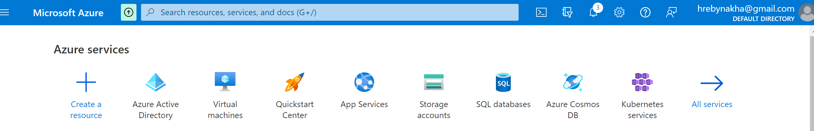

Creating an VM

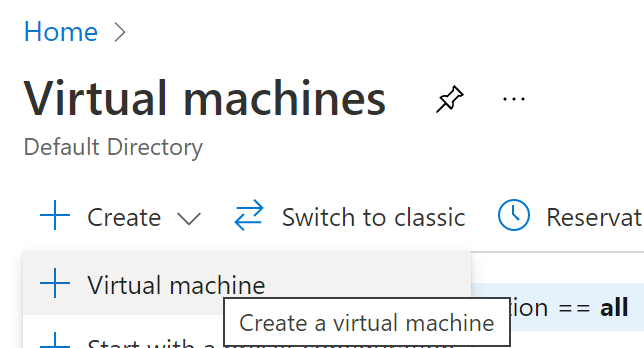

Machine created configuration:

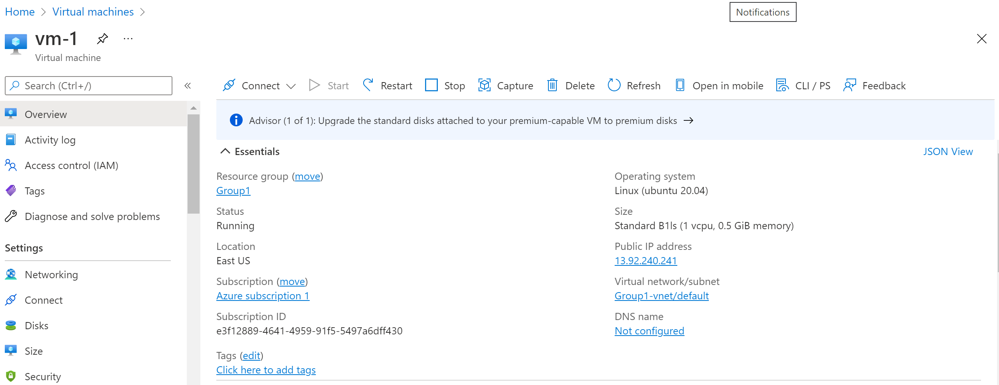

Connect to VM via ssh from **PowerSheel**

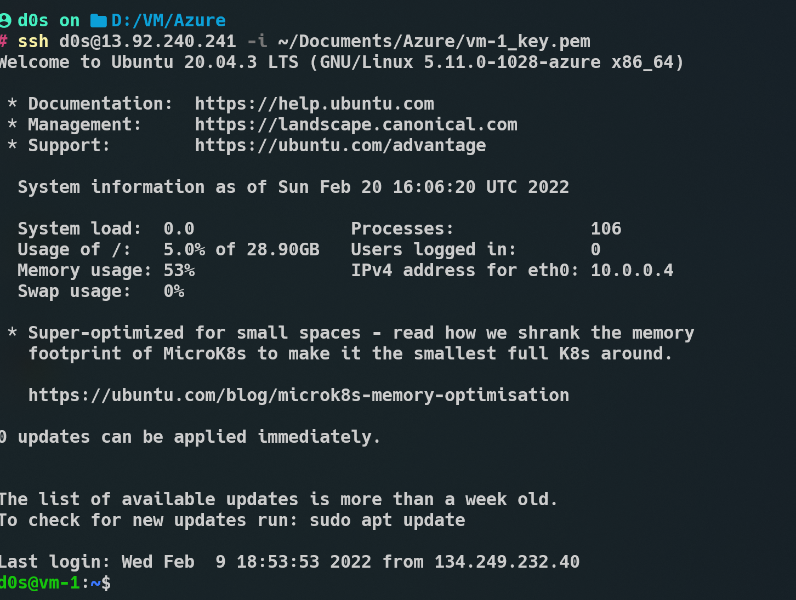


After created VM let's try create simple Web Server 

`curl 127.0.0.1`

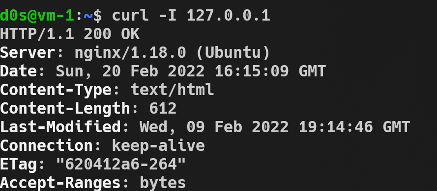

and on **Public IP Adress** http://13.92.240.241/ from Web Browser

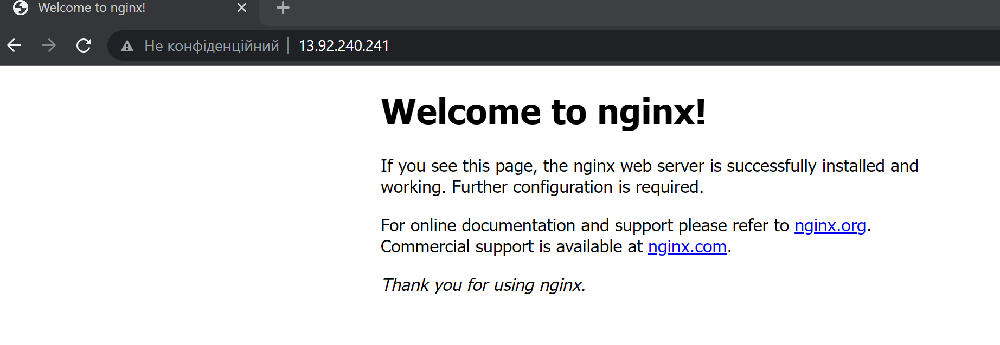

Next step we connect to Azure from Windows Terminal
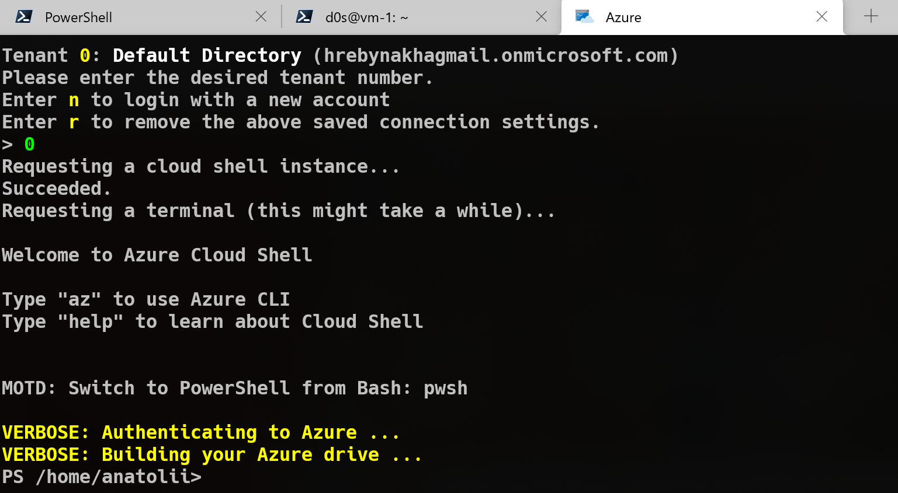


Create a snapshot of VM

Find command 
` Get-AzCommand '*snapsh*'`
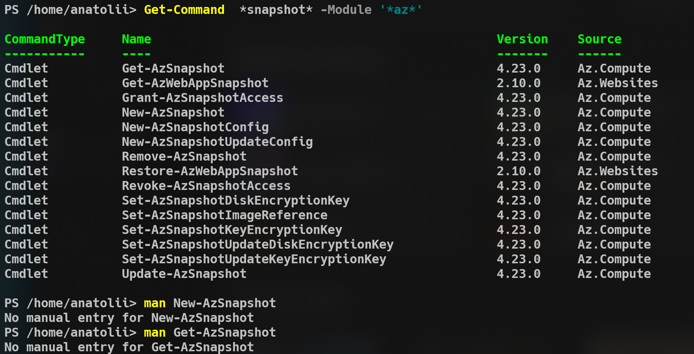
For creating an VM snapshot we need to know id of vm

For examle , a simple command to get all VM in Azure account
`Get-AzVM`
But we do not have an id of VM
Use selecting of all obgects:
`Get-AzVM | Select-Object *`
The attribut of vm id named as **VmID**
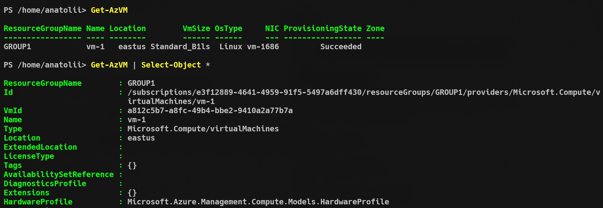

Creating a snapshot following command recived by previos step
```
$snapshotName = 'Snapshot1-vm-1'
$vmName = 'vm-1'
$location = 'eastus'
$resourceGroupName = 'GROUP1'
```

We have a **successfully** output
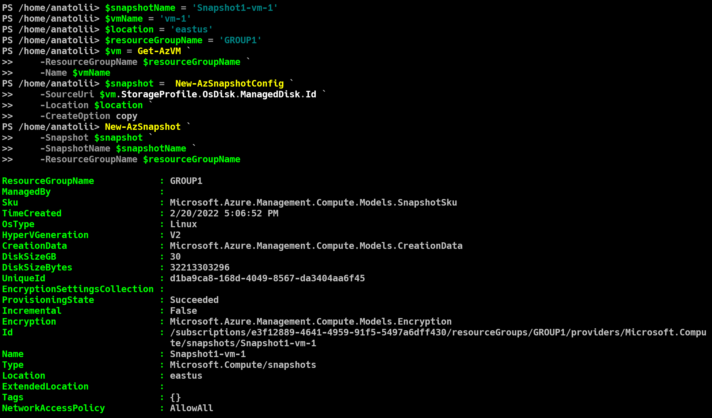


Creating and attching disk to VM from management console
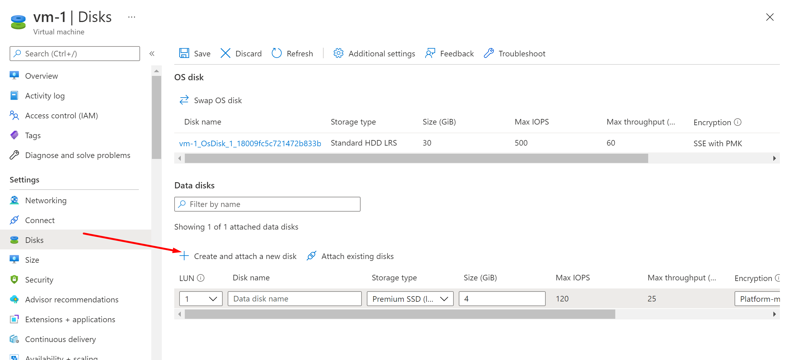

Result on VM:

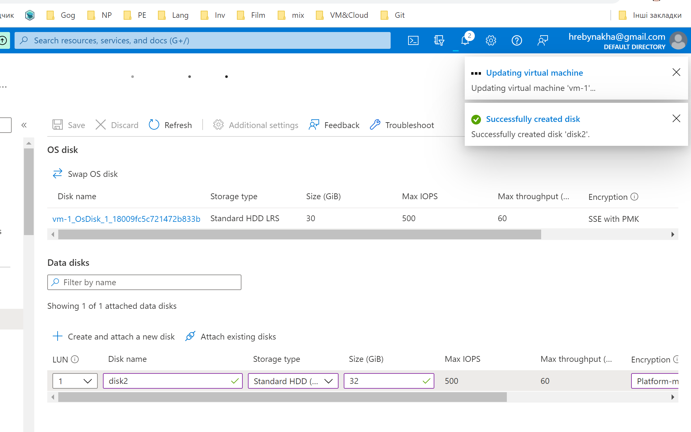

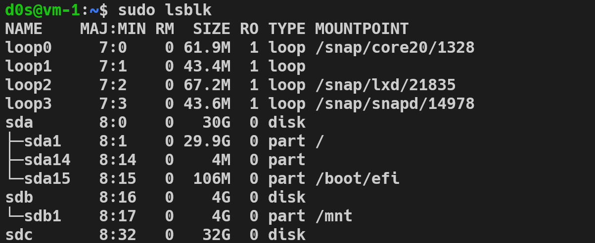


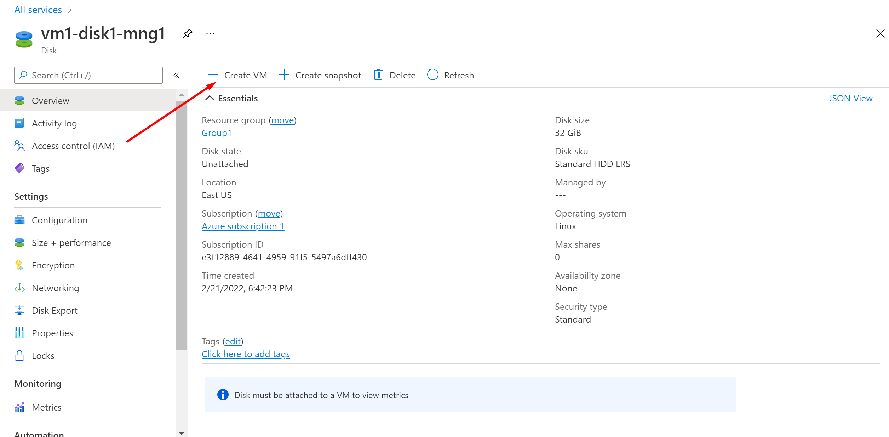


Get list of exisiting VM:
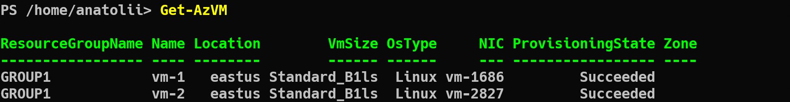
Get information about disk :
`Get-AzDisk | Select-Object Name,DiskState,Location,DiskSizeGB,TimeCreated`

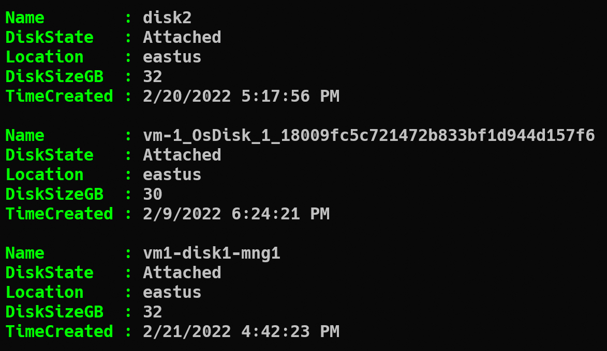

Reatacching disk to vm-2

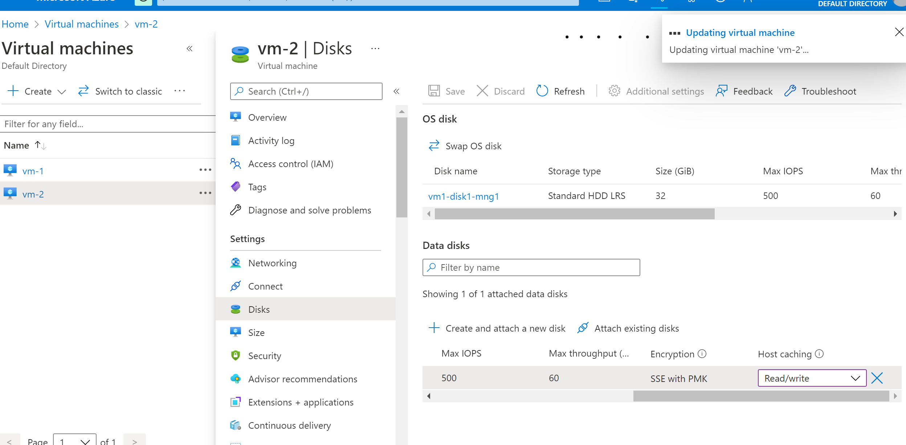

Result is (mashine name keep old)

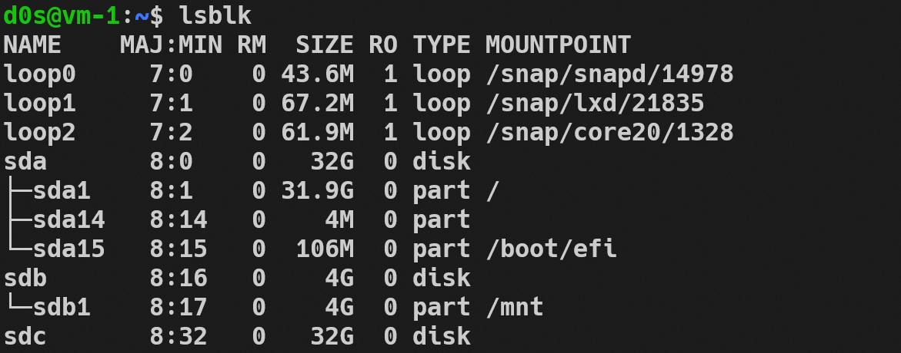
