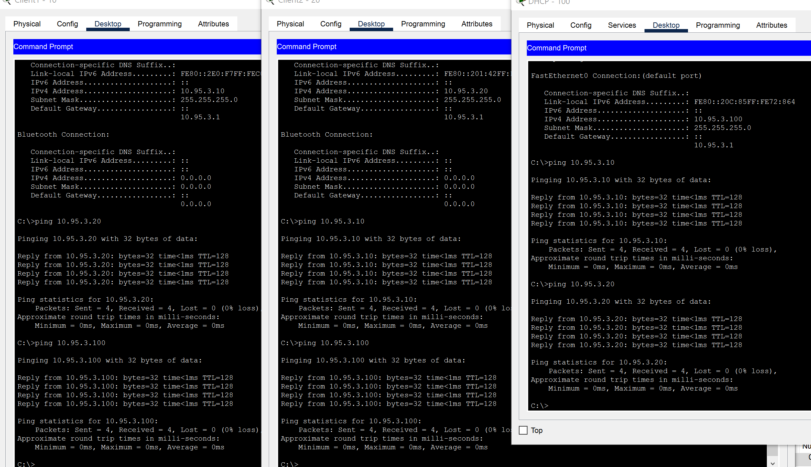
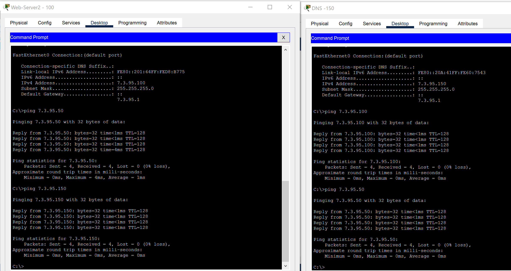
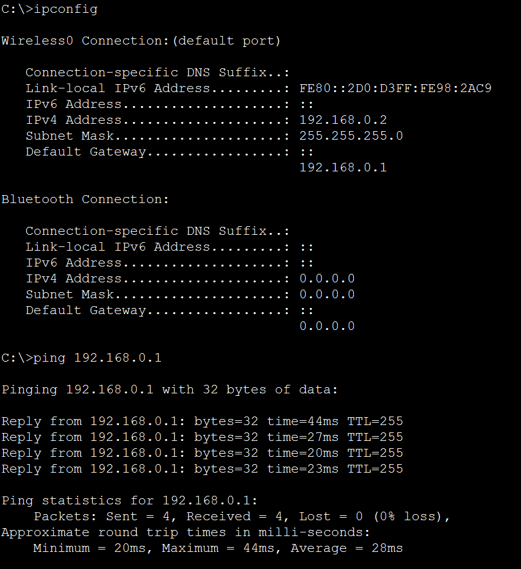
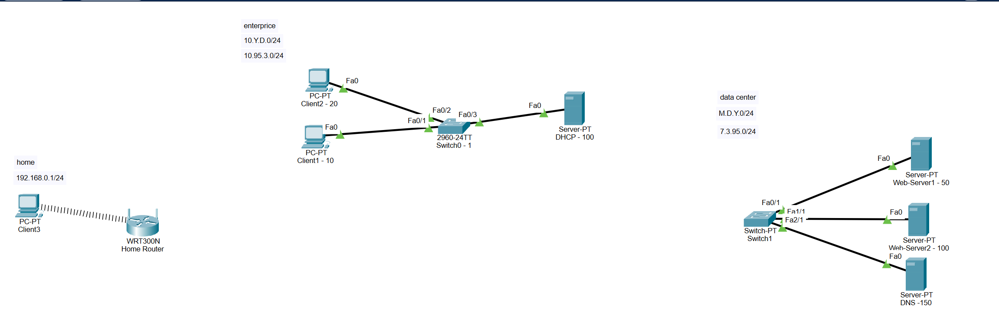

# Work with Cisco Packet Tracer
### Creating Enterprice, Data Center and Home Network in CPT
### Enterprice

### Data Center

### Home

### Result

We created 3 differnt network :
- 10.95.3.0/24 for the enterprice (usually  this network using in companies (Local Area Network))
- 7.3.95.0/24 for the Data Centre newtwork (in the main this netwok used by DC and have many white IP addresses)
- 192.168.0.1/24 for the Home Network (ordinary home Wi-Fi router network)