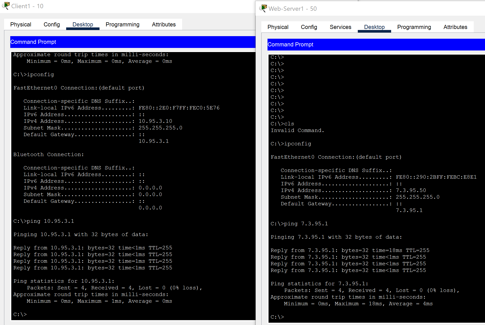
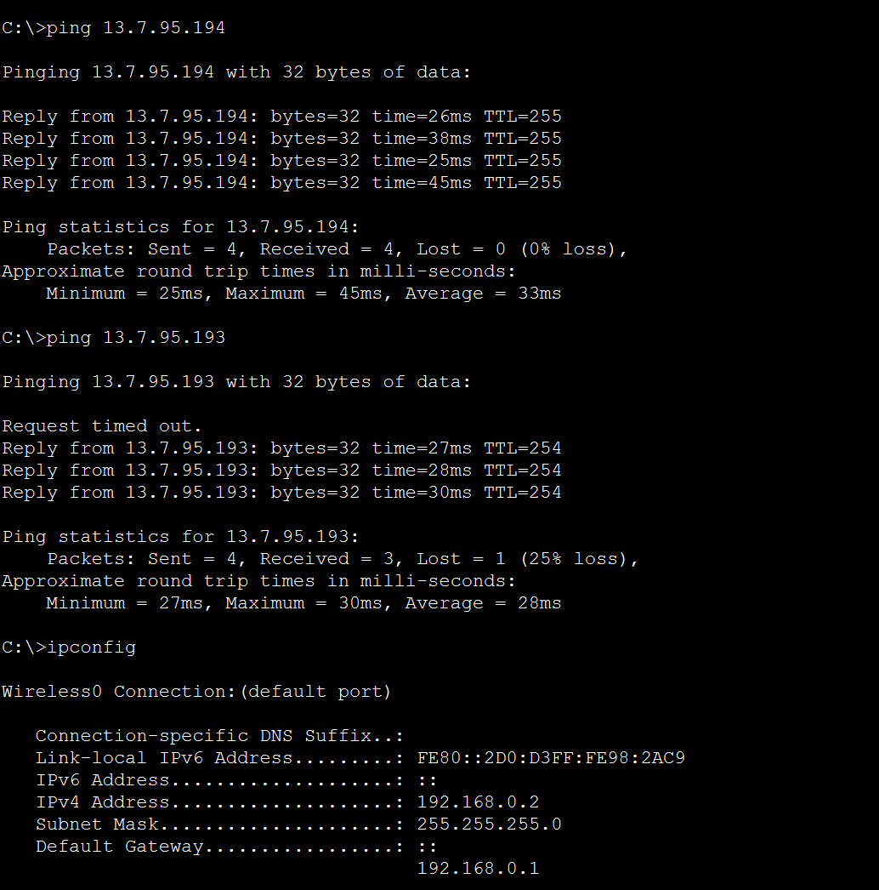
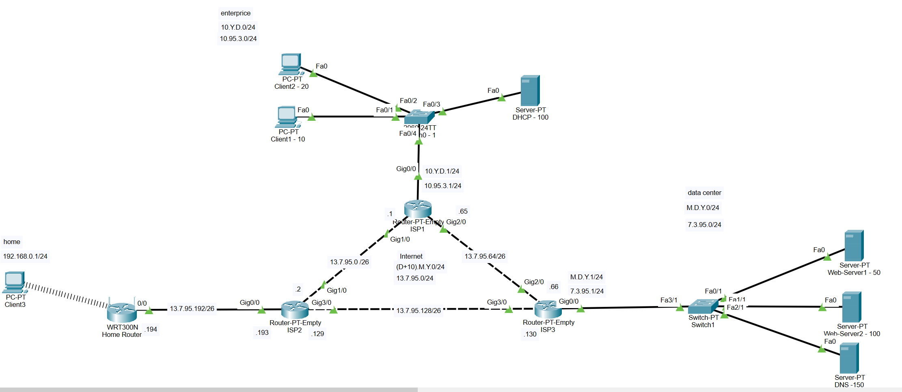
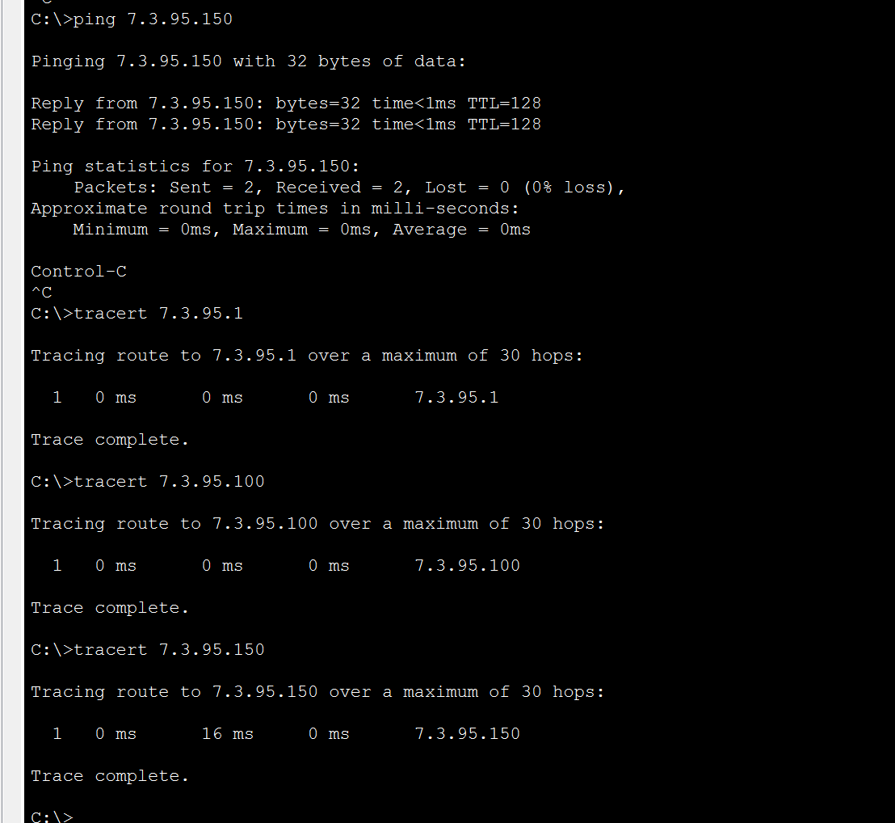
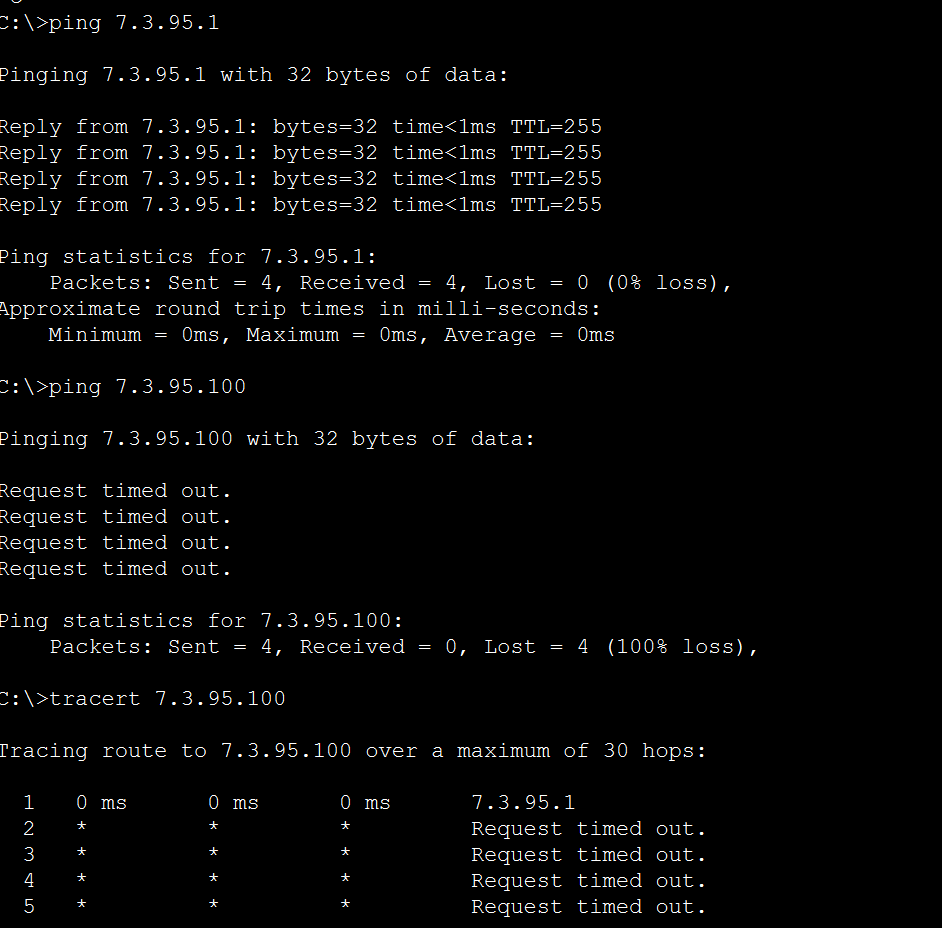
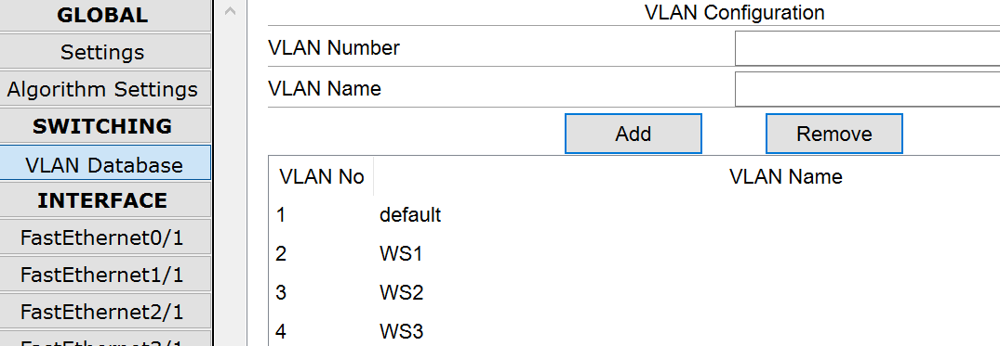
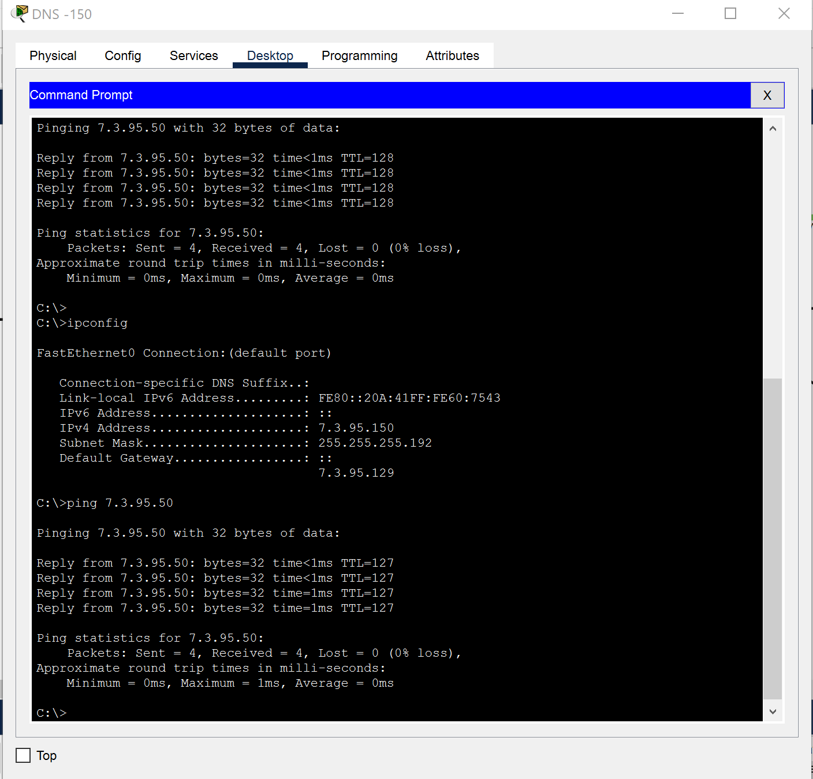
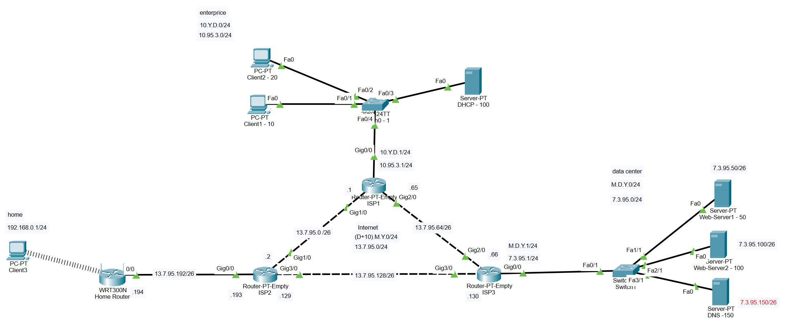

# Work with Cisco Packet Tracer 
### Connect the networkCreating Enterprice, Data Center and Home Network in CPT

### Enterprice & Data Center

After adding 2 Routers with name **ISP1** and **ISP2** and configure the IP Adresses we can ping our Default Gateway. This will be this roures.



### Home

After configure the third Router with name **ISP3** with address `13.7.95.193` and configure the **Home** router with IP Address `13.7.95.194` we will get this result.



In the end we got this scheme of our network:



Internet network : `13.7.95.0/24`

And 4 subnet:
- `13.7.95.0/26`
- `13.7.95.64/26`
- `13.7.95.128/26`
- `13.7.95.192/26`

### VLAN

Before change configuration we have successed test with all host in DC



After reconfigure mask of network from `255.255.255.0` to `255.255.255.192` we have success `ping` test to our default gateway `7.3.95.1` but we lost connection with all device in our DC.



This happend because we just divide the network into subnets:
- IP Address `7.3.95.50/26` belongs to `7.3.95.0/26` subnet
- IP Address `7.3.95.100/26` belongs to `7.3.95.64/26` subnet
- IP Address `7.3.95.150/26` belongs to `7.3.95.128/26` subnet

And create VLAN on the our switch



We also do not have successed ping with device in our DC 

After reconfigure our gateway by this script in **CLI**

```
Router(config-if)# interface GigabitEthernet0/0.2
Router(config-subif)#encapsulation dot1Q 2
Router(config-subif)#ip address 7.3.95.1 255.255.255.192
Router(config-if)# interface GigabitEthernet0/0.3
Router(config-subif)#encapsulation dot1Q 3
Router(config-subif)#ip address 7.3.95.65 255.255.255.192
Router(config-if)# interface GigabitEthernet0/0.4
Router(config-subif)#encapsulation dot1Q 4
Router(config-subif)#ip address 7.3.95.129 255.255.255.192
```

We have got ping with any devices in our Data Centr



The scheme of our network will be as follows


