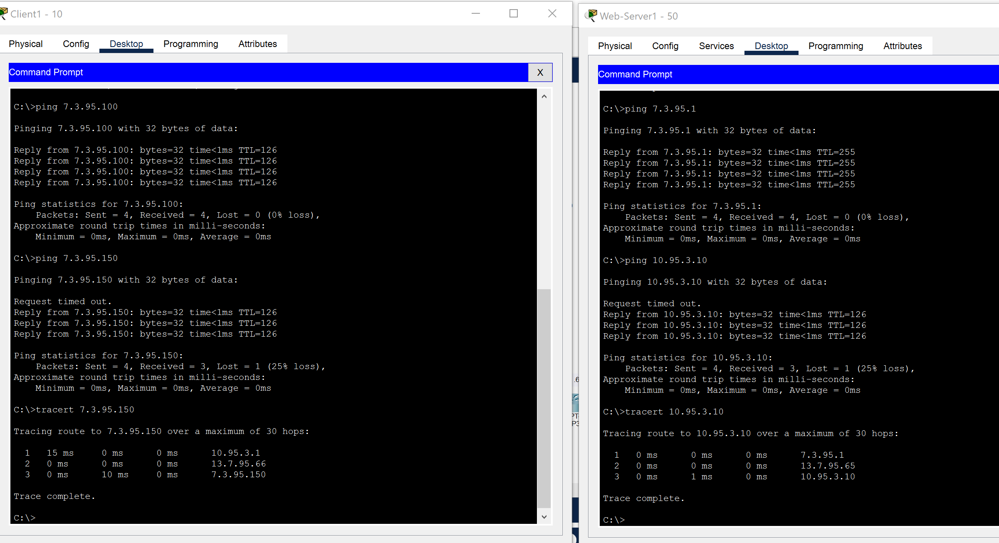
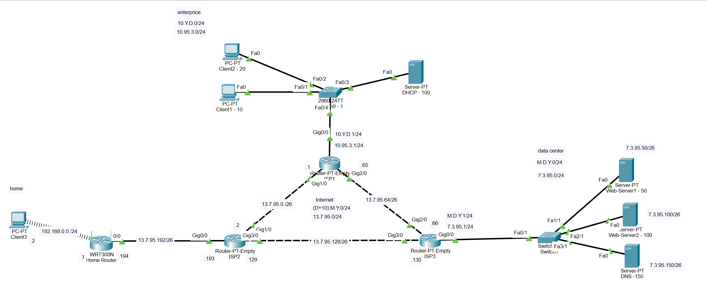
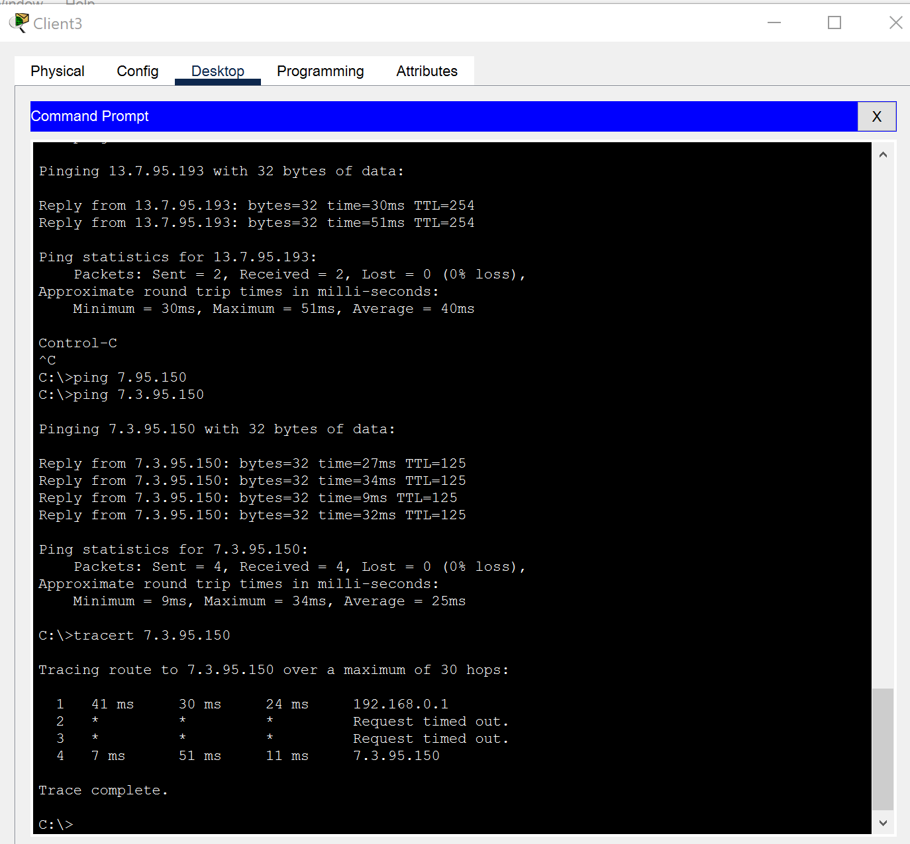

# Work with Cisco Packet Tracer 
### The routers IP Adresses tables
##### ISP1
| Router | Interface | Network IP Address| Host  IP Address|
| ---- | ------- | ------------- | ------------- | 
| ISP1 | Gig 0/0 | 10.95.3.0 /24 | 10.95.3.1 /24 |
| ISP1 | Gig 1/0 | 10.95.3.0 /24 | 10.95.3.1 /24 |
| ISP1 | Gig 2/0 | 13.7.95.0 /26 | 13.7.95.1 /26 |
##### ISP2
| Router | Interface | Network IP Address| Host  IP Address|
| ------ | ------- | --------------- | --------------- | 
| ISP2   | Gig 0/0 | 13.7.95.192 /26 | 13.7.95.193 /26 |
| ISP2   | Gig 1/0 | 13.7.95.0 /26   | 13.7.95.2 /26   |
| ISP2   | Gig 3/0 | 13.7.95.128 /26 | 13.7.95.129 /26 |
##### ISP3
| Router | Interface | Network IP Address| Host  IP Address|
| ---- | ------- | --------------- | --------------- | 
| ISP3 | Gig 0/0 | 7.3.95.0 /24    | 7.3.95.1 /24    |
| ISP3 | Gig 2/0 | 13.7.95.64 /26  | 13.7.95.66 /26  |
| ISP3 | Gig 3/0 | 13.7.95.128 /26 | 13.7.95.130 /26 |
##### Home Router
| Router | Interface | Network IP Address| Host  IP Address|
| ----------- | ----- | --------------- | --------------- | 
| Home Router | 0/0   | 13.7.95.192 /26 | 13.7.95.194 /26 |
| Home Router | Wi-Fi | 192.168.0.0 /24 | 192.168.0.1 /24 |

We need to configure route table
On **ISP1** we add the next route (network-mask-next hop):
`ip route 7.3.95.0 255.255.255.0 13.7.95.66`
On **ISP2** we add the next route (network-mask-next hop):
`ip route 7.3.95.0 255.255.255.0 13.7.95.130`
`ip route 10.95.3.0 255.255.255.0 13.7.95.1`
On **ISP3** we add the next route (network-mask-next hop):
`ip route 10.95.3.0 255.255.255.0 13.7.95.65`

Make some test:


And result schema of our network:


The **RIP** configuration:
On our routers input next command in CLI 
For **ISP1**:
```
network 10.0.0.0
network 13.0.0.0
```
For **ISP2**:
```
network 13.0.0.0
```
For **ISP3**:
```
network 7.0.0.0
network 13.0.0.0
```

After this confuguration we have also successfully `ping` from home PC (**Client3**) to dns Server `7.3.95.150`

