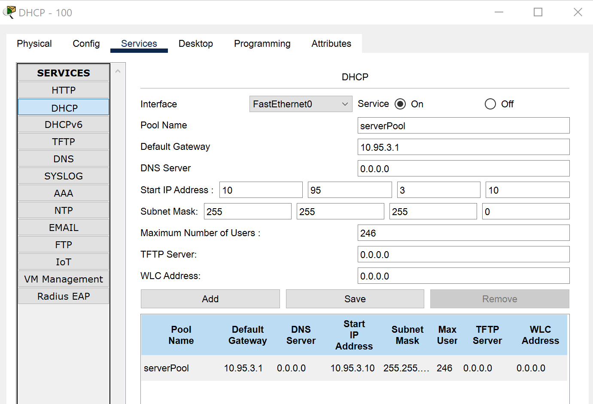
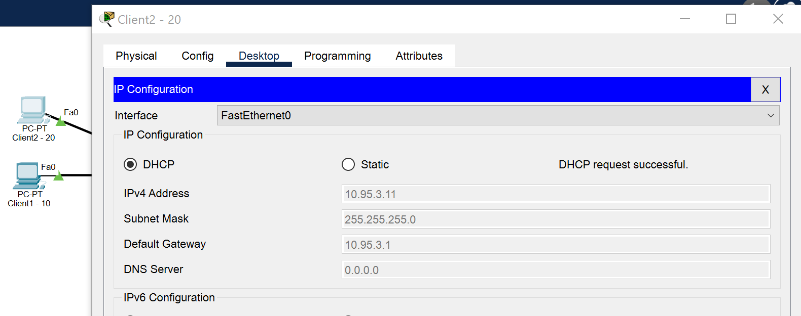
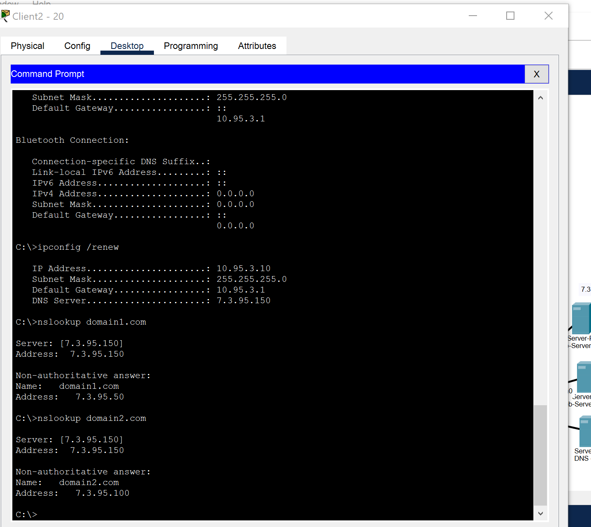
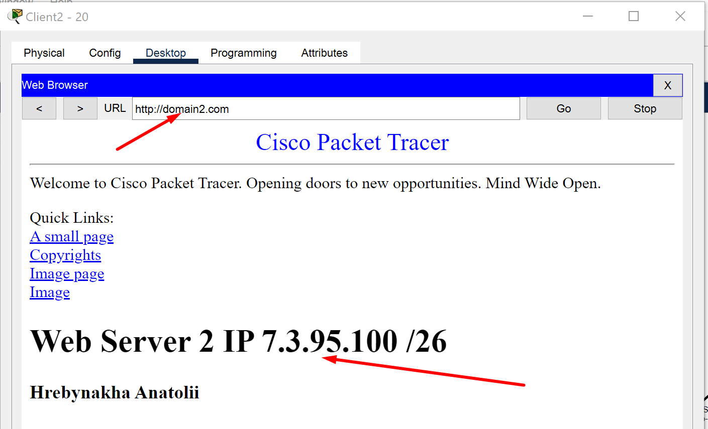
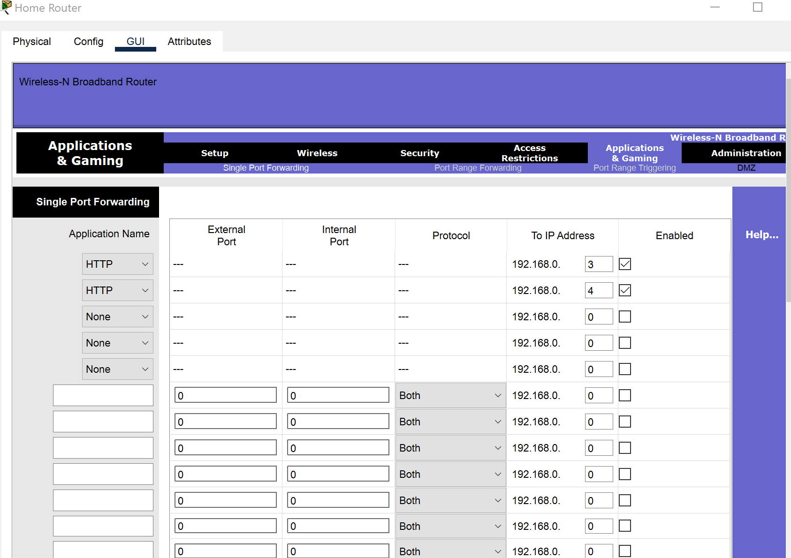
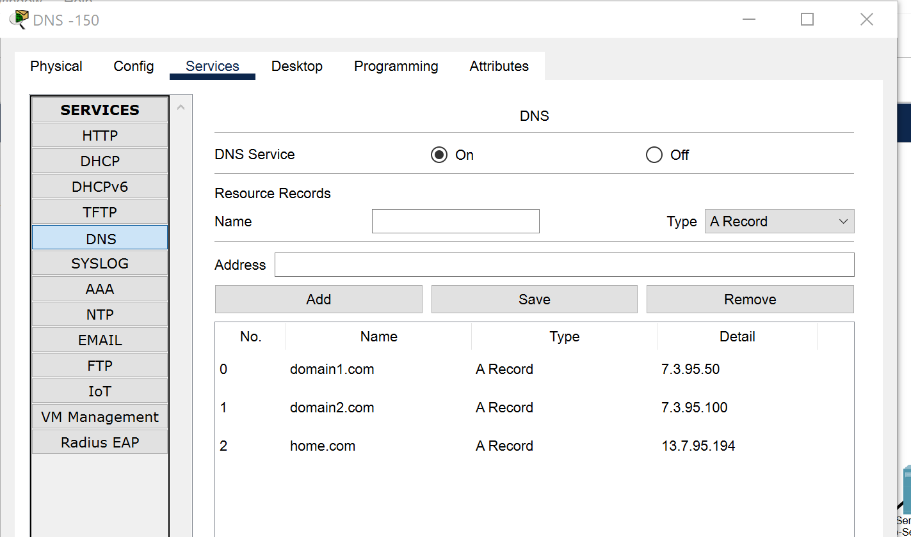
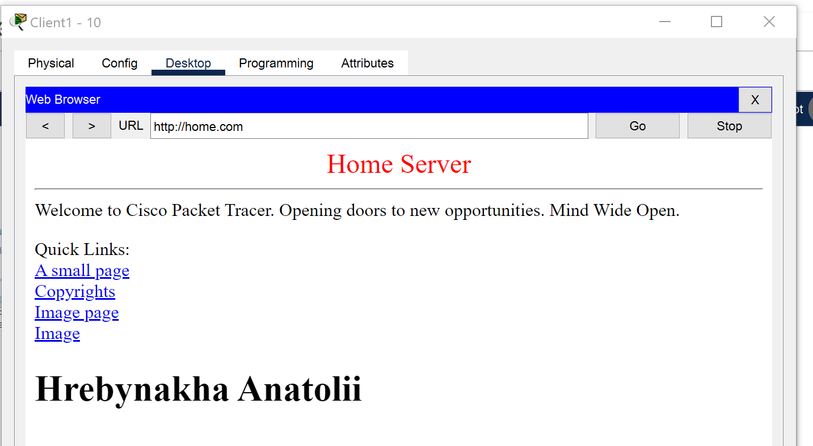

# Work with Cisco Packet Tracer 
### Configure DHCP in Enterprice newtwork

`ipconfig /renew`

### Configure DNS in Enterprice newtwork

On the DNS server `7.3.95.150 /26` configure DNS zones name:

|Name| Type| IP|
|-----|------|------|
|domain1.com| A | 7.3.95.50|
|domain2.com| A |7.3.95.100|

After adding this dns? try to  resolve it on this client:

And now, we have an option to open web wrowser and see the content:

### Router port forwarding

On the Home Office newtwork add new web server with ip `192.168.0.4`

and on home router configuration add next rule to port forwarding:

In DNS server add new record :

|Name| Type| IP|
|-----|------|------|
|home.com| A | 13.7.95.194|

**DNS** configuration result:

> In DNS server we add the **Public** IP Address  (this IP Address is the adress of router, not home server)

Home web server working with port forwarding on home router: 

