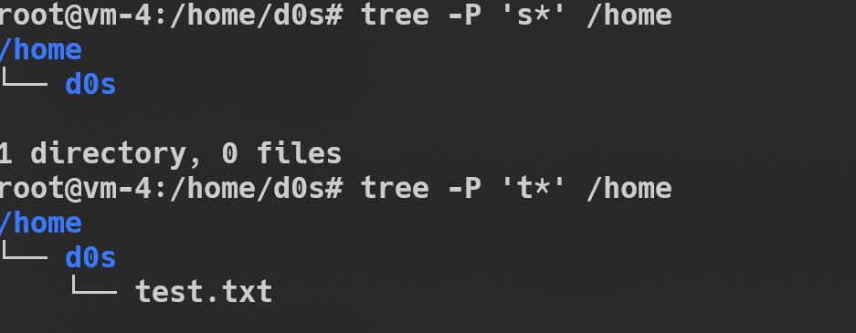

# Useful ubuntu command
## Part 1
- Get information about system 

`uname -a`

`lsb_release -a`


- Get root (sudo) rights

`sudo -s`


- Using `passwd` command

> This cahged the file located in **/etc/shdow** directory

`cat /etc/shadow`


- Login to server using **ssh** and **Powershell** command

> Command in **Windows Terminal** 


> Loggined via **ssh**


> Get the sudo (root) rights


- Command for chaging user personal information

> Using the **man** for get the manual about command

`man chfn`

`chfn d0s -w "2003"`

- manual about **finger** command


`finger d0s`


- chaging information about user

`chfn --extrausers`


- and after set information

`finger d0s`


- Using  **less** and **more** command  View the contents of files

`less /bin/gettext.sh`


`more /etc/bash.bashrc`


- Determine the last logon time for all users.

`finger -s`


- List the contents of the home directory using the ls command, define its files
and directories

`ls -R /home`


## Part 2
- The **tree** command. Display all files that contain a character *c*, or files that contain a specific sequence of characters. List subdirectories of the root directory up to and including
the second nesting level

`tree  -d /home`


`tree  -a /home`


`tree /home`


`tree -P 's*' /home`

`tree -P 't*' /home`



- **file** command can be used to determine the type of file 
`file /etc/*`
> Out innformation (file name and file type)


- navigate in the file system using relative and absolute paths

```
root@vm-4:/etc# cd opt/
root@vm-4:/etc/opt# ls
root@vm-4:/etc/opt# cd /home/d0s/
root@vm-4:/home/d0s# ls
folder  test.txt
root@vm-4:/home/d0s#
```


- using **ls** command 
> Getting tha help about this command
`man ls`


```
ls -a
ls -l
ls -al
```


- using  I (Input) / O (Output) command **</>**
`tree /home > testfile.txt`


- using **copy** command

` cp ./testfile.txt /home/d0s/`


- usig **mkdir** command we have created the folder named *folder*
- using **ln** command we created soft and hard link


- using **mv** commamnd to rename the files


- using **remove** command
`rm -rf folder/`
`rm testfile.txt`

> The different of **hard** and **soft** link is that if we delete the file of lineked by soft link , that this file is not availble. But if we using the hard link the hard link still avaible for us.


> Copy file with another name command

`cp .bash_history ./test/labwork2`

 - Find all files that contain the squid and traceroute
sequence.
`locate squid`

`locate traceroute`


- using the find command, find all files in the /etc directory containing the host
character sequence.
`sudo find /etc -name "*host*" -type f -print`

>Also we can using the **grep** command to find duplicate a similar command using in output 


- using **df** to determine the type of file in the system

` df -Th`

 

> The **tmpfs** and **squashfs** is a *Temproary* file sysytem to only  reading information.
 Follow link to read more information  - [Wiki](https://uk.wikipedia.org/wiki/Tmpfs)  