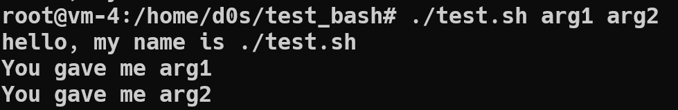

# 1
The **/etc/passwd** file contains a list of users who are known to the system. During the user registration process, the system accesses this file in search of the user ID and his home directory. Each line of the file describes one user and contains seven fields separated by colons:

- Registration name. Registration names must be unique and consist of no more than 32 characters.
They can contain any characters except the colon and the newline character. They don't have to start with numbers.

- Encrypted password or password "placeholder". This field may contain an "x", a "*" or a set
random symbols and numbers. In the first case, it is specified that the password is stored in the **/etc/shadow** file. In the second case it is said that this account is temporarily disabled. In the latter case, the user's direct password is specified in encrypted
Where are you.

- User ID is a 32-bit integer that is unique identifies the user in the system. By default, IDs are less than 500 reserved for service accounts. Regular users have identifiers starting with 500.
      
- Default group ID. Like a user ID, a group ID (GID) is a 32-bit integer.
ID 0 is reserved for the group named root, ID 1 is reserved for the bin group, and 2 is reserved for the daemon group. 

- Personal data field. The GECOS field is mainly used to store personal information about each user. It is not has a clearly defined syntax. The structure of this field can be arbitrary, but the finger command interprets the separated ones comma elements of this field in the following order: full name; office and building number; work phone; home phone.

- Home catalog. After logging in, the user enters his home directory. If at the time of registration this directory is absent, a message about its absence is displayed. If DEFAULT_HOME is the default home directory field value "no" is set in the **/etc/login.defs** file, it will not be possible to continue user registration; otherwise the user gets to the root directory. By default, users' home directories are created in the / home directory. When added to the system of a new user, all files from the **/etc/skel** directory, which contains personal files, are copied to his home directory.
batch and various program configuration files.

- Command interpreter. As a registration shell, as a rule, the command interpreter is set, for example, **/bin/sh** or **/bin/csh**, but in principle, it can be any program. The bash interpreter is used by default. Users can change the interpreter with the chsh command. The **/etc/shells** file contains a list of interpreters which are available for selection.


The **/etc/group** file contains the names of the groups present in Linux and the member lists of each group, for example:

`daemon: x: 2: root, bi n, daemon`

In this case, the system has a daemon group with an ID of 2. This group includes root, bin, and daemon users.
Each entry in the / etc / group file represents one group and contains four fields:

* Group name. By default, when you create a new user, you also create a group with the same name as the registration user username.
* Encrypted password or x character indicating the use of the **/etc/gshadow** file;
* Group ID.
* List of members separated by commas without spaces.


# 2

UID
A UID (user identifier) is a number assigned by Linux to each user on the system. This number is used to identify the user to the system and to determine which system resources the user can access.
|UID(s) value | Description |
| ----------- | ------------ |
|  0 (zero)   |  is reserved for the root |
| 1–99        | are reserved for other predefined accounts. |
| 100–999     | are reserved by system for administrative and system accounts/groups. |
| 1000–10000  | are occupied by applications account. |
| 10000+      | are used for user accounts.|

Follow `id` we can get own UID

result of sudo(root) user:


and for user  simple account


# 3

GID
Groups in Linux are defined by GIDs (group IDs).
|GID value  | Description |
| --------- | ----------- |
| 0 (zero)  | is reserved for the root group. |
| 1–99      | are reserved for the system and application use. |
| 100+      |allocated for the user’s group. |

# 4 

Follow command `groups username`  we cann get the information of user in group


# 5 

To add/create a new user, you’ve to follow the command `useradd` or `adduser` with **username**. The **username** is a user login name, that is used by a user to login into the system.

Examle of executing command `useradd username`


# 6

To change the username use the command `usermod -l login-name old-name`
also we can change name by user ID `usermod -u UID username`

# 7

The **skel** directory
Directory **/etc/skel/** (skel is derived from the “skeleton”) is used to initiate home directory when a user is first created. A sample layout of “skeleton” user files is as shown below:

`ls -lart /etc/skel`


# 8

To remove user from system use the command  `userdel username`

# 9

To lock a user account use the command `usermod -L username`  or `passwd -l username` , where the **username** is a user login name, that we want to lock.

To verify get the **/etc/shadow/** file contents:


> The "!" in user column means that user is locked.

To unlocking a user account we can use the command `passwd -u username`


# 10

The quick way to remove/delete a user password is pass --delete option to the passwd command.We need loggined as root user (using sudo command/su) command and type the following command: `passwd --delete username` or `passwd -d username`


# 11

To display the extended format of information about the directory


The first character shows the file type. In this example, the first character is -, which indicates a regular file. Values for other file types are as follows:


- "-" - Regular file.
- b - Block special file.
- c - Character special file.
- d - Directory.
- l - Symbolic link.
- n - Network file.
- p - FIFO.
- s - Socket.

The next nine characters are showing the file permissions. The first three characters are for the user, the next three are for the group, and the last three are for others. You can change the file permissions with the chmod command. The permission character can take the following value:

- r - Permission to read the file.
- w - Permission to write to the file.
- x - Permission to execute the file.
- s - setgid bit.
- t - sticky bit

# 12 

Each file and directory has three user based permission groups:

**owner** – The Owner permissions apply only to the owner of the file or directory, they will not impact the actions of other users.
**group** – The Group permissions apply only to the group that has been assigned to the file or directory, they will not affect the actions of other users.
**all users** – The All Users permissions apply to all other users on the system, this is the permission group that you want to watch the most.


Each file or directory has three basic permission types:

**read** – The Read permission refers to a user’s capability to read the contents of the file.
**write** – The Write permissions refer to a user’s capability to write or modify a file or directory.
((execute** – The Execute permission affects a user’s capability to execute a file or view the contents of a directory.

Viewing the permissions by command `ls -l`

# 13
First of all determinate **Who am I**
If you have not become another user, your ID is still the one you used to log in. Command ` whoami` show the account name.

Next step is **What groups am I in**

Determining group membership

`id`

Determining file ownership

` ls ‑l filename`

Permissions and directories

`ls ‑l /home`


# 14
To cahne owner of file(directory) can be used the next command `chown username filename` 

An example change owner from **root** to **d0s** (an account):


# 15

| Octal Value	| Binary representation |	Meaning|
| --- | --- | --- |
| 0	| 0	| No read, write, and execute permissions (—)|
| 1	| 1	| Only execute permission (–x)|
| 2	| 10 | Only write permission (-w-)|
| 3	| 11 | Write and execute permissions (-wx)|
| 4	| 100 | Only read permission (r–)|
| 5	| 101 | Read and execute permissions (r-x)|
| 6	| 110 | Read and write permissions (rw-)|
| 7 | 111 | Read, write, and execute permissions (rwx)|


**Umask**, or the user file-creation mode, is a Linux command that is used to assign the default file permission sets for newly created folders and files. The term mask references the grouping of the permission bits, each of which defines how its corresponding permission is set for newly created files. The bits in the mask may be changed by invoking the umask command.


# 16

In computing, the sticky bit is a user ownership access right flag that can be assigned to files and directories on Unix-like systems.

There are two definitions: one for files, one for directories.

For files, particularly executables, superuser could tag these as to be retained in main memory, even when their need ends, to minimize swapping that would occur when another need arises, and the file now has to be reloaded from relatively slow secondary memory. This function has become obsolete due to swapping optimization

Sticky bit Examples
In this section, we will discuss how to set and unset sticky bit using some examples.

A basic example
Create a directory and provide all the users read-write-execute access to it :

` mkdir allAccess `

` chmod 777 allAccess/`

` ls -ld allAccess `


So we see that a directory named **allAccess** is created and read-write-execute access to this directory is given to all the users through chmod command.

Now, create multiple files in this directory (with different users) such that all users have read-write-execute access to them.

For example:

` ls -l allAccess/`


The files test_file_user0.txt  and test_file_user1.txt are created by different users but have read-write-execute access on for all the users. This means that the user **d0s** can delete or rename the file created by user **test1**.

An examle of  renaming file 


In order to avoid this, sticky bit can be set on the directory allAccess.

Now, turn ON the sticky bit on the directory by using +t flag of chmod command.

` chmod +t allAccess/`

` ls -ld allAccess/`


As can be observed, a permission bit **t** is introduced in the permission bits of the directory.

Now, if the user **d0s** tries to rename the file **test_file_user1_renamed_by_dos.txt**, here is what happens :


So we see that the operation was not permitted.


# 16
What file attributes should be present in the command script - executable
`sudo chmod +x filename`

For examle write simle script :

```
#!/bin/bash
echo hello, my name is $0

while (($#))
do
    echo You gave me $1
    shift
done
```
Get the information about rights:


Where we tring to run script we got an error *-bash: ./test.sh: Permission denied*
This happend becouse we do not have permission on file to execute this.


And now we get the otput of our script:
