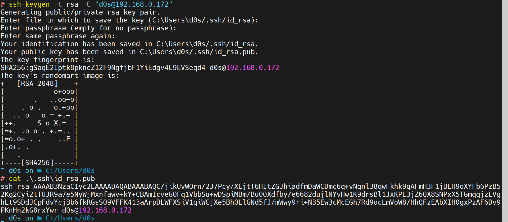
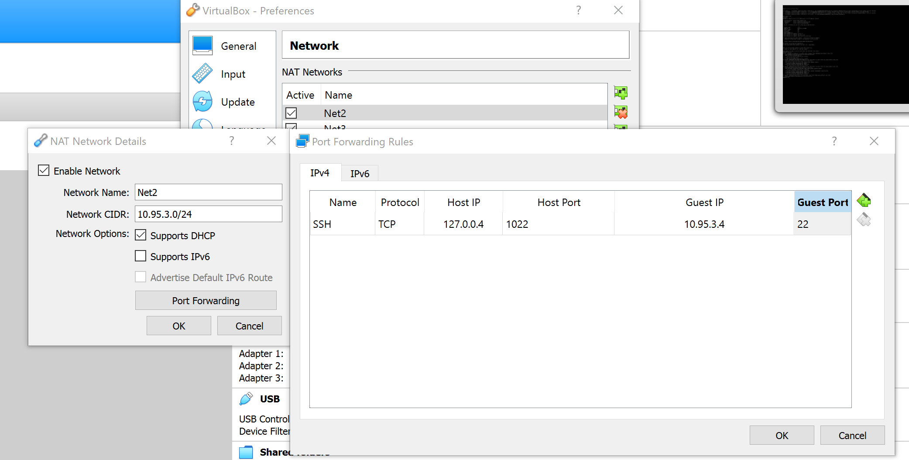

# Part 1

## 1
Porocess in Linux systems has a 5 states:
- Running or Runnable (R)
- Uninterruptible Sleep (D)
- Interruptable Sleep (S)
- Stopped (T)
- Zombie (Z)

## 2

pstree command


## 3
Proc file system  is virtual file system , creating when system booting and dissolved at time when system shut down.

## 4

Information about the processor we can get using command
`cat /proc/cpuinfo`


## 5 

Use the ps command to get information about the process. The information should be as
follows: the owner of the process, the arguments with which the process was launched for
execution, the group owner of this process, etc.

`ps -eo  user,group,pid,%cpu,%mem,command`


## 6
How to define kernel processes and user processes?

Kernel processes or threads do not have their own address space, they only work in the kernel address space. And they can be run before the kernel starts any user process . User processes have their own virtual address space.


## 7
Print the list of processes to the terminal. Briefly describe the statuses of the processes.
What condition are they in, or can they be arriving in?

`ps -ef`


- UID  - its User ID
- PID - process ID    
- PPID - Parent proceess ID
- C  - CPU Usage
- STIME - Time started
- TTY - Terminal associated with the process
- TIME  - total CPU usage
- CMD - command to execute

## 8
Display only the processes of a specific user.

`ps -u d0s`

## 9
What utilities can be used to analyze existing running tasks (by analyzing the help for the ps
command)?

`top`
`pstree`

## 10 
What information does top command display?

display Linux processes

## 11 

Display the processes of the specific user using the 
top command.

`top -u d0s`


## 12

What interactive commands can be used to control the top command? Give a couple of examples.

use `f` to control fields of output


And now we get more information in output


## 13 

Sort the contents of the processes window using various parameters (for example, the amount of processor time taken up, etc.)

Use the `f` key to go interactive menu and choise the new sort value by `s` key.
Than we chegend the sor output value here


## 14 

Concept of priority, what commands are used to set priority?

The process scheduling priority range is from -20 to 19. We call this as nice value.

A nice value of -20 represents highest priority, and a nice value of 19 represent least priority for a process.


Crete a script that will be write date to log file and run it with command:

`bash test.sh  &`


**[1] 44660** showing the PID of ran process.


Using command `nice` we can chage priority of porcees, for examlpe run script with low priority (10)


and run now we get thow runned script with low and normal priotity (**NI** colomn)


Also run with the higth priority:


## 15 

Can I change the priority of a process using the top command? If so, how?

unig the `r` key we can change th priority of the process by `top` command


after input PID of proceess (for examlpe **45391**)

And now we can see that piority of procees chaged from 10 to 19 


## 16

Examine the kill command. How to send with the kill command process control signal? Give an example of commonly used signals.

Using  `kill 45391` we can the close porcess .

When a signal is sent to a process, that signal, or notification, may meet a default action as a response or may be handled by a signal handler. A signal handler is a custom code of the program whose process received the signal, which defines the behavior of the process when the signal is received (except for signals SIGKILL and SIGSTOP, which can’t be handled, ignored, nor blocked).
 
The **SIGSTOP** just the stop porcess

`kill -SIGSTOP  44660`


but **SUGKILL** the close porcess

`kill -SIGKILL  44660`


## 17 
Commands jobs, fg, bg, nohup. What are they for? Use the sleep, yes command to demonstrate the process control mechanism with fg, bg.

In script **test.sh** use the `sleep` command to set script delay.


# Part 2
## 1

Check the implementability of the most frequently used OPENSSH commands in the MS Windows operating system. (Description of the expected result of the commands +screenshots: command – result should be presented)

Unsing command to check the OpenSSH installed.

`Get-WindowsCapability -Online | Where-Object Name -like 'OpenSSH*'`

We are using  the Powershell Terminal early and connect to VM via SHH 


More info [here](../task4.1/README.md/#ssh-connecting)

## 2

Implement basic SSH settings to increase the security of the client-server connection (atleast)

The basic SSH setting configurating in file **/etc/ssh/sshd_config**

Opne file and set configuration:

`vi /etc/ssh/sshd_config`

Set  RSA and Public key auth to **yes**

```
RSAAuthentication yes
PubkeyAuthentication yes

```


## 3 

List the options for choosing keys for encryption in SSH. Implement 3 of them.

SSH Keys can be crypted by RSA, DSA, ECDSA, or EdDSA hash algoritm.


In **Windows Powershell** Generate the **RSA** key type:

`ssh-keygen -t rsa -C "d0s@192.168.0.172"`

> This command will generete two keys
> also yo cau use the passphrathe or set it to empty

In folder **.ssh** creating new files: *id_rsa* and *id_rsa.pub*




The content of *id_rsa.pub* copy to file *authorized_keys* our VM to folder **.ssh** in **home** directory :


`ssh d0s@192.168.0.172`


And now we can auth withou password!


Othe type of auth will be similar. Genereate pair and auth withou password.


## 4

Implement port forwarding for the SSH client from the host machine to the guest Linux virtual machine behind NAT.

In our VM we need to have an NAT interface 
Follow command  `ip a` we foun an IP **10.95.3.4** address of our NAT


Go to VM setting on VirtualBox manager and define that Nat2 is a out interface to configuration


Open settings in VM Box File>Perferences>Network
and add new rule to port forwarding From Host IP **127.0.0.4** with port 1022 we will forfard to **10.95.3.4** with 22 port.



And run test ` ssh d0s@127.0.0.4 -p 1022` :

> **_NOTE_** we need to set port 1022 in our command because in NAT rule we indicated it port


Detail about port forwarding [here](../task2.1/README.md#networking)
