# Networking in Oracle Virtual BOX using Linux System

## Schema of viruals mashines

### Network Table Configuration

|Network Name | Network IP|
| ---- | -------------- |
| Net1 | 192.168.74.0/24|
| Net2 | 10.95.3.0/24   |
| Net3 | 10.7.95.0/24   |
| Net4 | 172.16.3.0/24  |


In defaul in our Virtual Mashines we has an 10.0.2.15/24 network address


### Information about systems and IP Configuration:

| VM Name| Name in task |      OS             | Host  IP Address |
| ------ | ------------ | ------------------- | ---------------- | 
| VM-4   | Server_1     | Ubuntu Server 20.04 | 10.0.2.15/24     |
| VM-5   | Client_1     | Ubuntu Server 20.04 | 10.0.2.15/24     |
| VM-6   | Client_2     | Cent OS 7.9.2009    | 10.0.2.15/24     |

> The information about IP address will be chaging to **Network Table Configurations**

In VirtualBox crete new network from

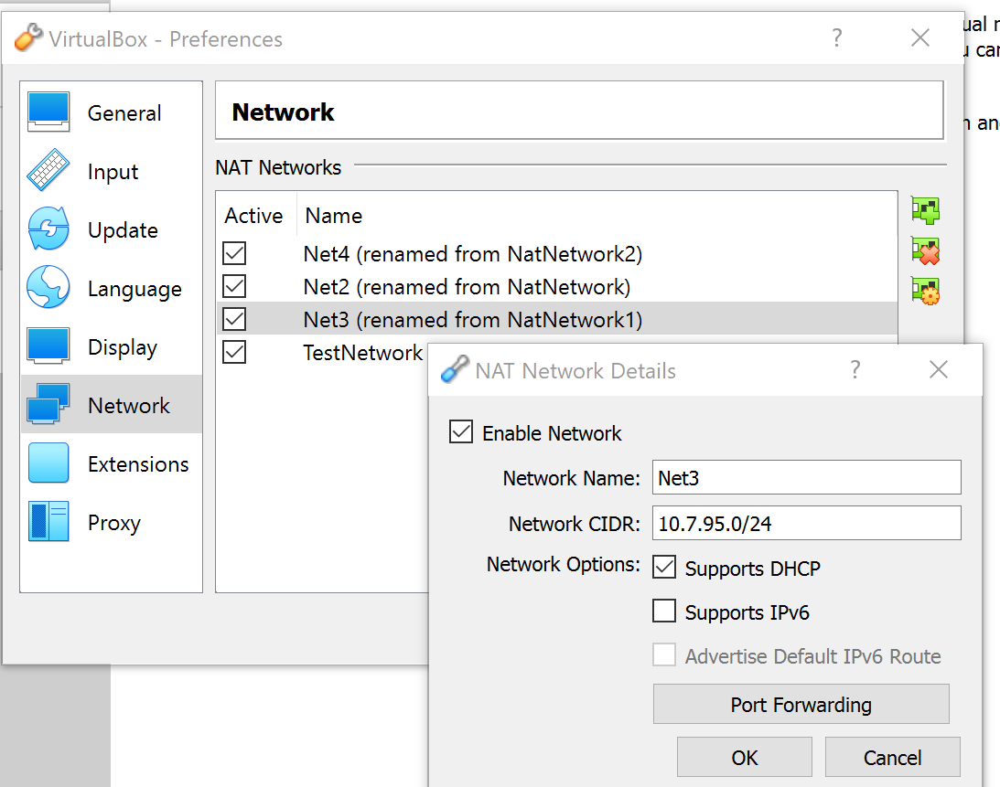

For **Net1** network using home network with IP 

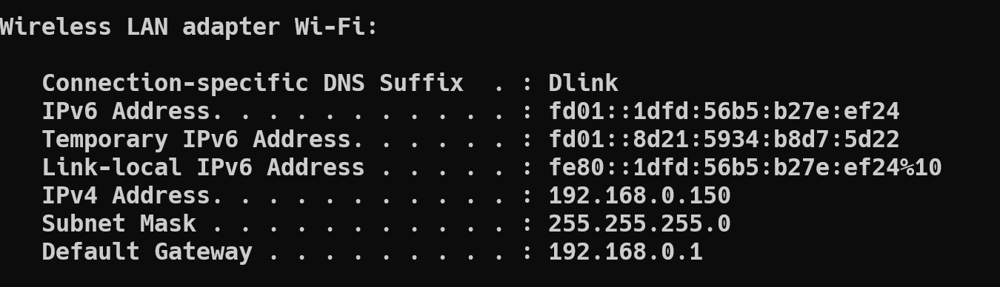

After configuring network using NAT Network in **Oracle VM Box**
we get the next IP Configuration from DHCP

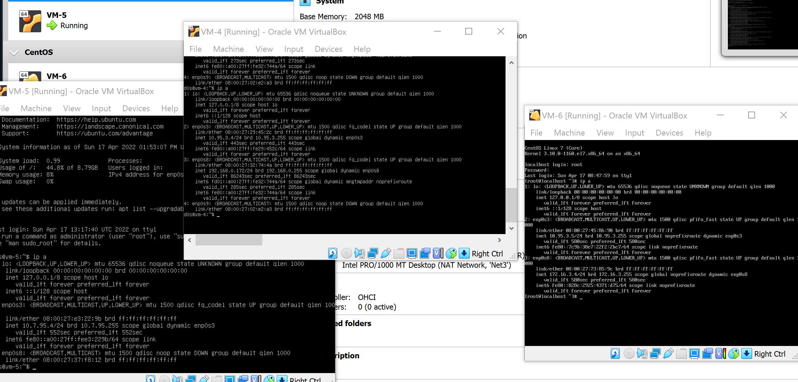
| VM Name| Name in task |      OS             | IP Addresses                                                |
| ------ | ------------ | ------------------- | ----------------------------------------------------------- | 
| VM-4   | Server_1     | Ubuntu Server 20.04 | Net1(192.168.0.172), Net2(10.95.3.4), Net3(**DOWN** 10.7.95.6)  |
| VM-5   | Client_1     | Ubuntu Server 20.04 | Net3(10.7.95.4), Net4(**DOWN** 172.16.3.5 )                 |
| VM-6   | Client_2     | Cent OS 7.9.2009    | Net2(10.95.3.5), Net4(172.16.3.4)    |

> On Ubuntu system we has a **DOWN** link. To get IP address use the command `sudo dhclient` 


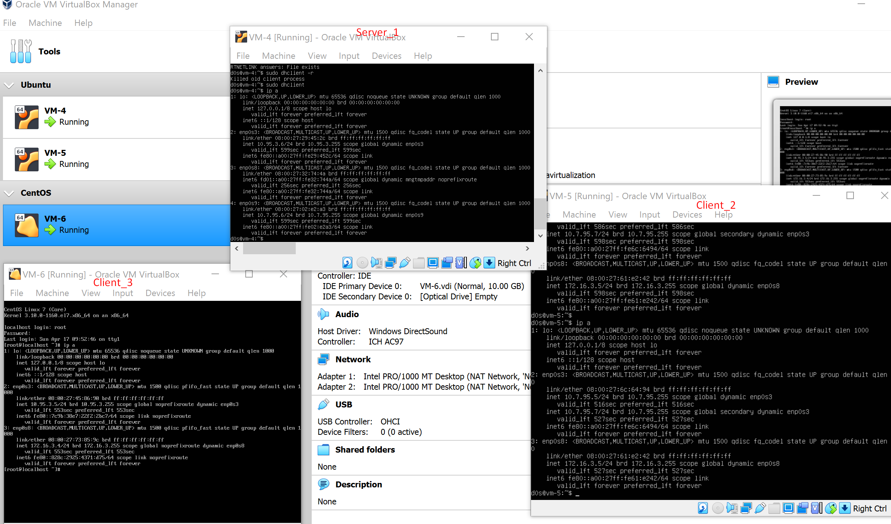


Also to autoconfigure IP on Server_1 Net3 , we can add interface `enp0s9` to *netplan*.

In result we got next:

  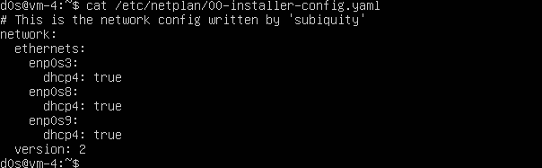


### Configure static IP Address

Static Ip configuration by chage the netplan file.


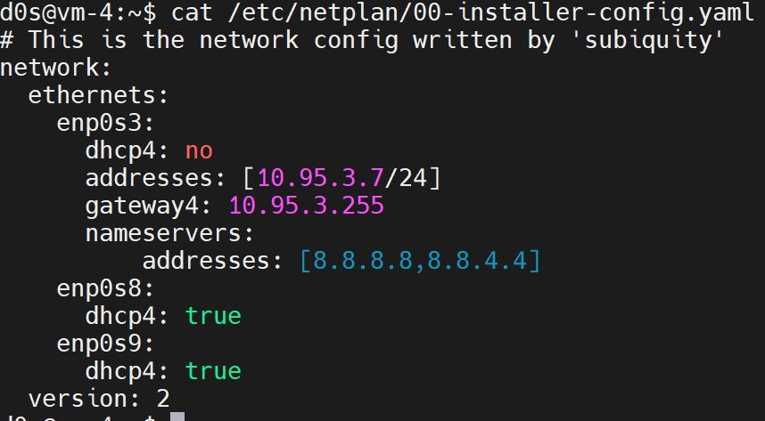

And we got an static IP Addresses.

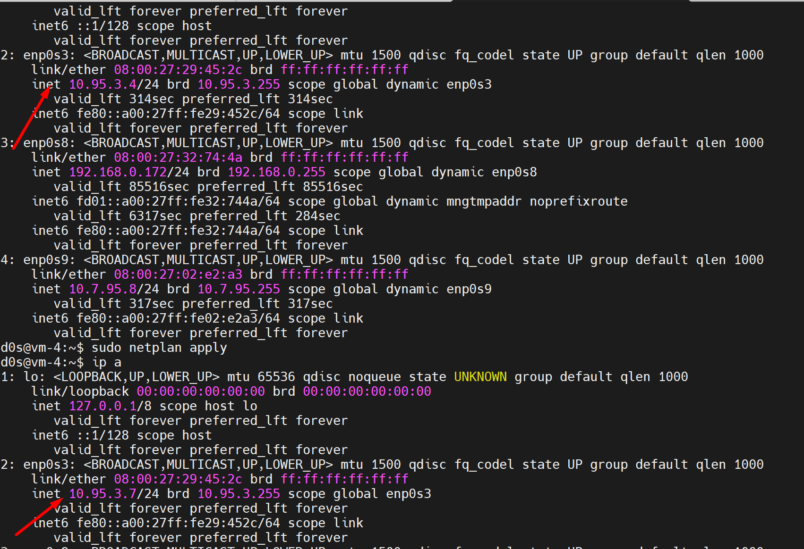

___
> **_WARNING_** In previosly screens we configured VM by NAT , not Internal Interface

But , we need to configure the DHCP on the server, and create new Internal Interfaces in Virtual Box.

Go to setting in VM and create all of  them.

Get new network table:

|Network Name | Network | 
| ---- | -------------- | 
| Net1 | 192.168.0.172/24| 
| IntNet2 | 10.95.3.0/24   |
| IntNet3 | 10.7.95.0/24   |
| IntNet4 | 172.16.3.0/24  |


On VM-4 (Server_1) install the DHCP server

#### DHCP installation&configuration

```
sudo apt-get install isc-dhcp-server
```

Edit the **/etc/dhcp/dhcpd.conf**

```

default-lease-time 600;
max-lease-time 7200;
authoritative;

subnet 10.95.3.0 netmask 255.255.255.0 {
 range 10.95.3.50 10.95.3.70;
 option routers 192.168.0.172;
 option domain-name-servers 10.95.3.1;

}

subnet 10.7.95.0 netmask 255.255.255.0 {
 range 10.7.95.20 10.7.95.30;
 option routers 192.168.0.172;
 option domain-name-servers 10.7.95.1;

}


```

And map it config to our interface:

```
vi /etc/default/isc-dhcp-server


INTERFACESv4="enp0s3 enp0s9"
```

After restart dhcp service we got a new ip address on VM-s:


| VM Name| Name in task |      OS             | Network,IP Addresses,Interface|
| ------ | ------------ | ------------------- | ----------------------------------------------------------- | 
| VM-4   | Server_1     | Ubuntu Server 20.04 | ,127.0.0.1,lo;Net1,192.168.0.172,enp0s8;IntNet2,10.95.3.1,enp0s3;IntNet3,10.7.95.1,enp0s9|
| VM-5   | Client_1     | Ubuntu Server 20.04 | ,127.0.0.1,lo;IntNet3,10.7.95.20,enp0s3;IntNet4,172.16.3.0,enp0s8|
| VM-6   | Client_2     | Cent OS 7.9.2009    | ,127.0.0.1,lo;IntNet2,10.95.3.53,enp0s3,IntNet4,**UNKNOWN**,enp0s8|

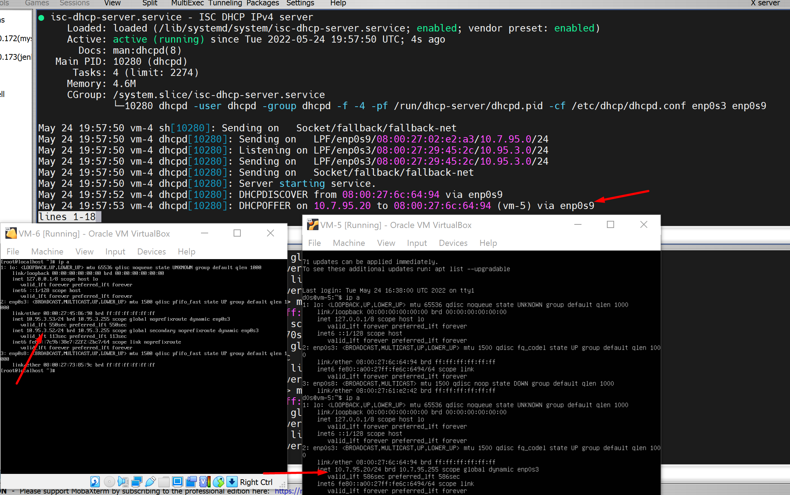


ping VM:

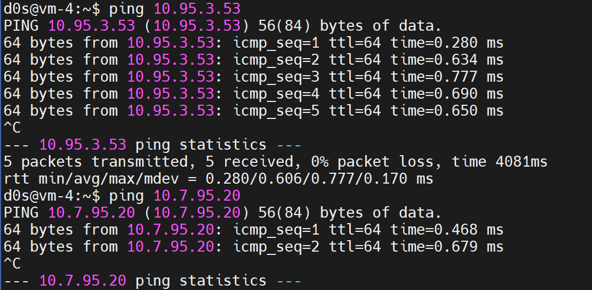

tracerout VM:

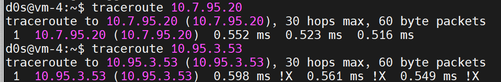

We see that we do not have any hope in our route


```
ip addr add 172.17.13.1/24  dev lo
ip addr add 172.17.23.1/24  dev lo
```
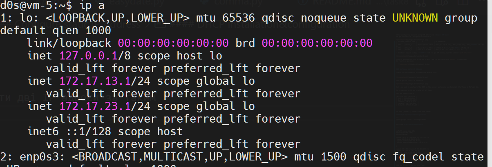

Now table has chaged to:

| VM Name| Name in task |      OS             | Network,IP Addresses,Interface|
| ------ | ------------ | ------------------- | ----------------------------------------------------------- | 
| VM-5   | Client_1     | Ubuntu Server 20.04 | ,127.0.0.1,lo;,172.17.13.1,lo;,172.17.23.1,lo;IntNet3,10.7.95.20,enp0s3;IntNet4,172.16.3.0,enp0s8|


On VM-6 (Client_2)  add  route

`ip route add 172.17.13.0/24 via 10.95.3.1 dev enp0s3`

On VM-4 (Server_1)  add  route

`sudo route add -net 172.17.13.0 netmask 255.255.255.0 gw 10.7.95.1`

Get the next tables of routes:

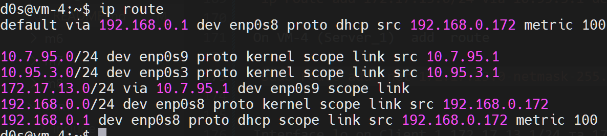

And allow the firewall forward rule:

`sysctl -w net.ipv4.ip_forward=1`


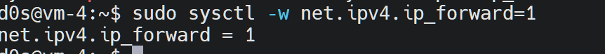

Ping test form vm-6 (Client_2) :

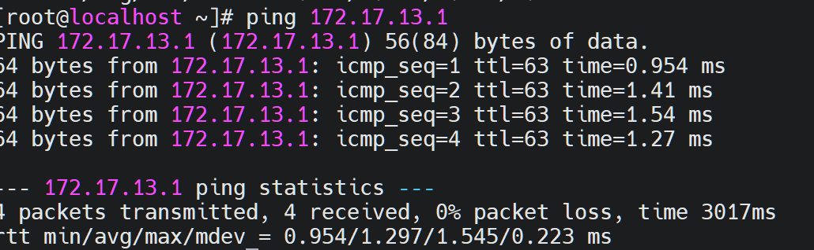

> **_NOTE_** In Home router add new route to IntNet to install the tracerout tools 
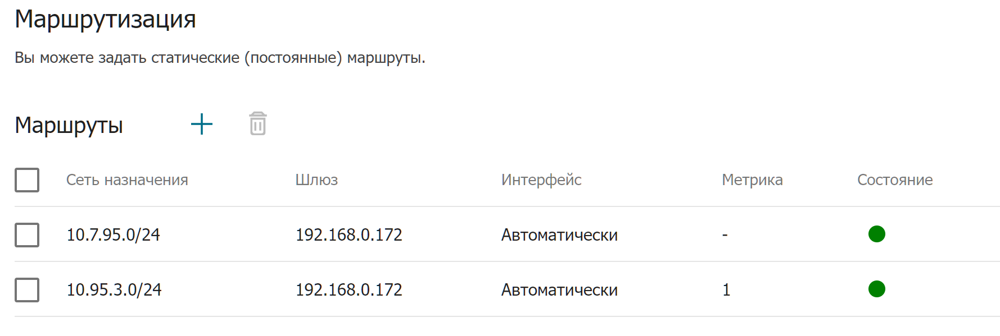

Tracerout test:

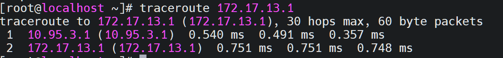

10.95.3.1 - Is a vm-4(Server_1)
172.17.13.1 - Destenationa address vm-5(Client_1)


#### Setting up the IntNet4 (172.16.3.0/24)
On vm-5 (Client_1) in netplan configuration file add to our IntNet4(enp0s8) interface add static IP 172.16.3.2:

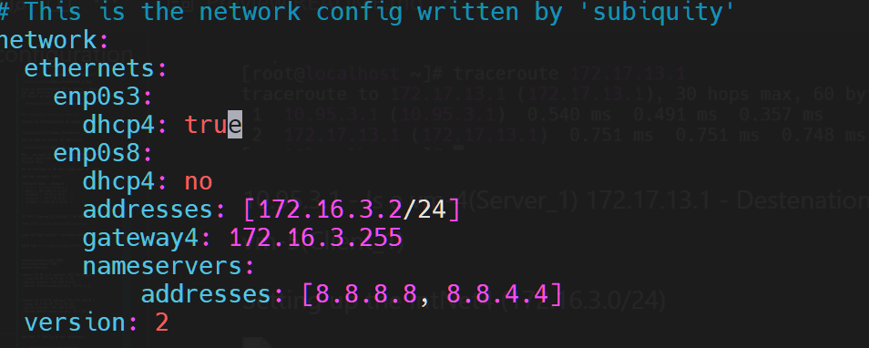


and apply setting `sudo netplan apply`


On vm-6 (Client_2)
Create or edit configuration file :

`sudo vi  /etc/sysconfig/network-scripts/ifcfg-enp0s8`

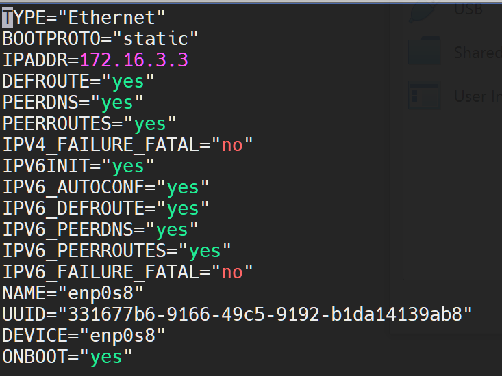


and add new route:

`ip route add 172.17.23.0/24 via 172.16.3.3 dev enp0s8`

and we get next route table and success ping and traceroute

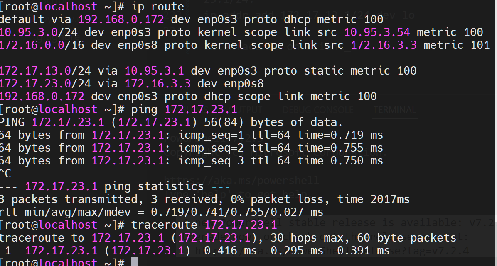

### Changing to one network

Calculating summurize of IP and  Address:

| Name| IP Address | Binary |
|---|---|---|
| Ip1| 172.17.13.1 | 10101100.00010001.000*01101 .00000000*|
| Ip2| 172.17.23.1 | 10101100.00010001.000*10111 .00000000*|
| Sum| 172.17.0.0 | **10101100.00010001.000***11111 .00000000* |
| Mask| 255.255.224.0 | **11111111.11111111.111***00000.00000000*|
| | | */27*|


On VM-4 (Server_1) delting old route and add new route 
``` 
sudo route add -net 172.17.0.0 netmask 255.255.224.0 gw 10.7.95.1
```

On VM-6(Client_2) delting old route and add new route  

```
ip route add 172.17.0.0/27 via 10.95.3.1 dev enp0s3
```

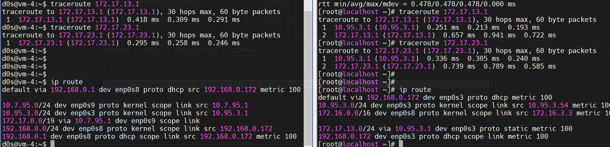


#### SSH Configuration 


1. From Client_1 to Client_2

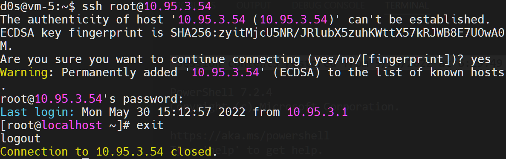

2. From Client_1 to Server_1

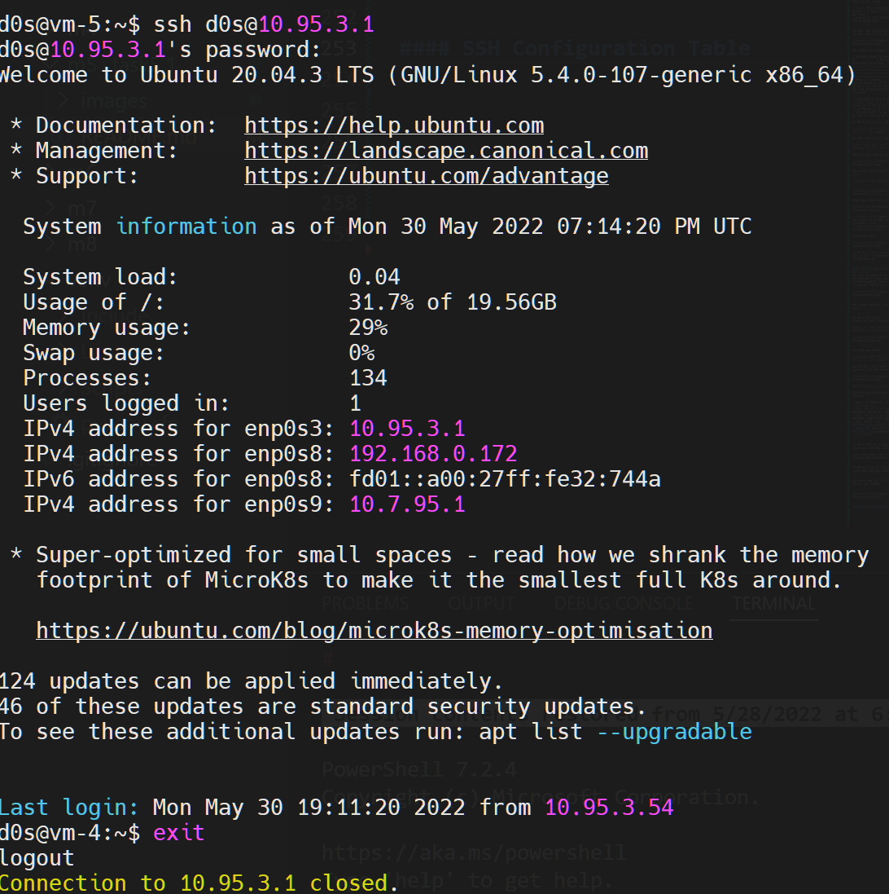

3. From Client_2 to Server_1

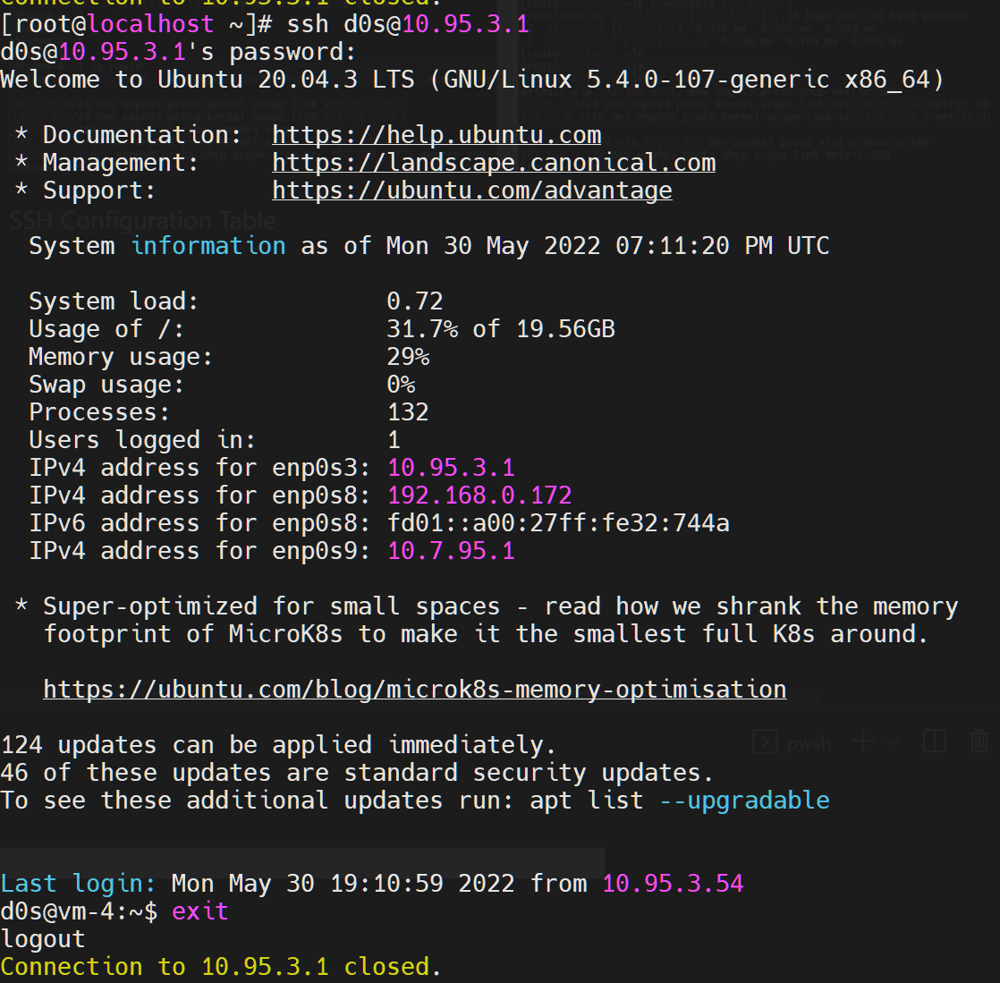

4. From Client_2 to Client_1

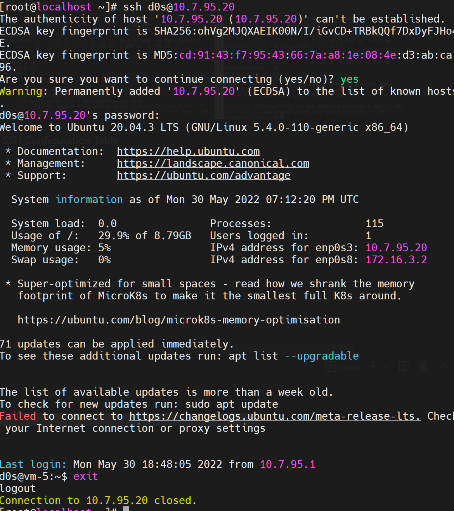

>**_NOTE_** From Server_1 to both client we already connected via ssh


### Firewall rules

1. To SSH:

```
sudo ufw deny from 10.95.3.54 to any port 22
sudo ufw allow from 192.168.0.150 to any port 22
sudo ufw allow from 10.7.95.20 to any port 22
sudo ufw delete 1

```

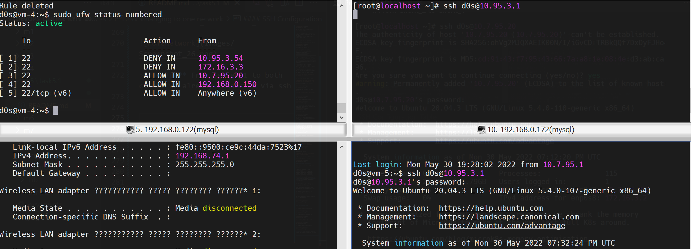


2. To ping (ICMP)

`iptables -I FORWARD -s 10.95.3.54 -d 172.17.23.1 -j DROP`

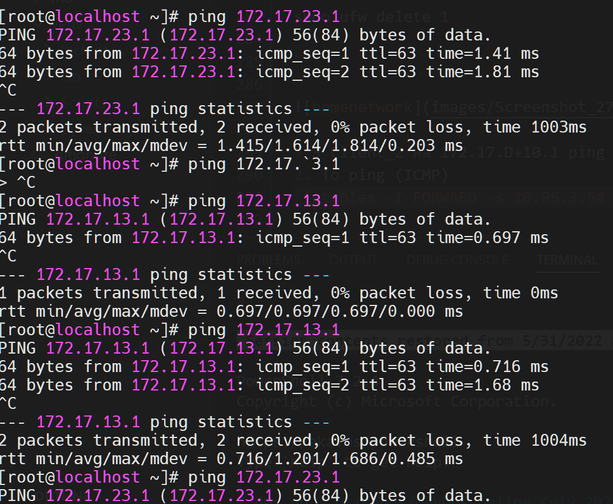

### NAT Configuration 

For access from internet to VM-5(Client_1) and VM-6(Client_2) add next rule on VM-4(Server_1)


```
sudo iptables -t nat -A POSTROUTING -s 10.7.95.0/24 -j SNAT --to-source 192.168.0.172
sudo iptables -t nat -A POSTROUTING -s 10.7.96.0/24 -j SNAT --to-source 192.168.0.172
```
And we got next on VM-6 (Client_2):

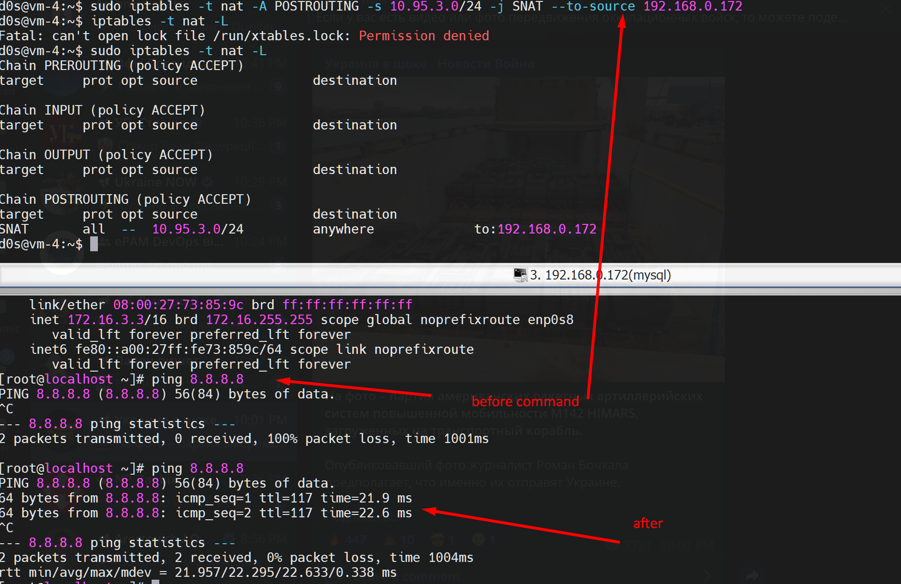

and on VM-5(CLient_1)
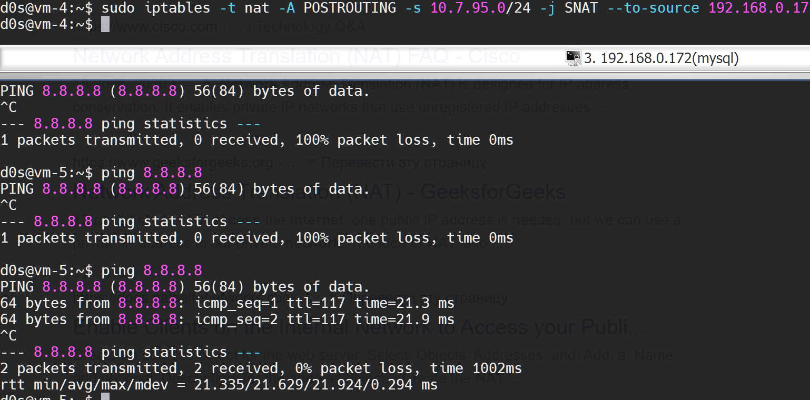

> **_NOTE_** On screenshot ping display before and after iptables adding rule command