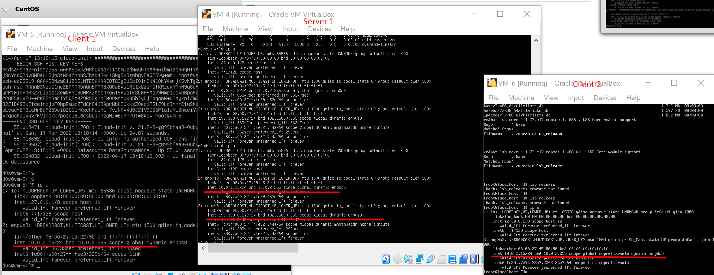

# Networking in Oracle Virtual BOX using Linux System

# Schema of viruals mashines

### Network Table Configuration
|Network Name | Network IP|
| ---- | -------------- |
| Net1 | 192.168.74.0/24|
| Net2 | 10.95.3.0/24   |
| Net3 | 10.7.95.0/24   |
| Net4 | 172.16.3.0/24  |

In defaul in our Virtual Mashines we has an 10.0.2.15/24 network address

### Information about systems and IP Configuration:

| VM Name| Name in task |      OS             | Host  IP Address |
| ------ | ------------ | ------------------- | ---------------- | 
| VM-4   | Server_1     | Ubuntu Server 20.04 | 10.0.2.15/24     |
| VM-5   | Client_1     | Ubuntu Server 20.04 | 10.0.2.15/24     |
| VM-6   | Client_2     | Cent OS 7.9.2009    | 10.0.2.15/24     |

> The information about IP address will be chaging to **Network Table Configurations**

In VirtualBox crete new network from

For **Net1** network using home network with IP 

After configuring network using NAT Network in **Oracle VM Box**
we get the next IP Configuration from DHCP

| VM Name| Name in task |      OS             | IP Addresses              |
| ------ | ------------ | ------------------- | ------------------------- | 
| VM-4   | Server_1     | Ubuntu Server 20.04 | 10.95.3.4 , 192.168.0.172 |
| VM-5   | Client_1     | Ubuntu Server 20.04 | 10.7.95.4                 |
| VM-6   | Client_2     | Cent OS 7.9.2009    | 10.95.3.5, 172.16.3.4     |

> On Ubuntu system we has a **DOWN** link on Net4 Network *(172.16.3.0/24)*
This happend becouse ?