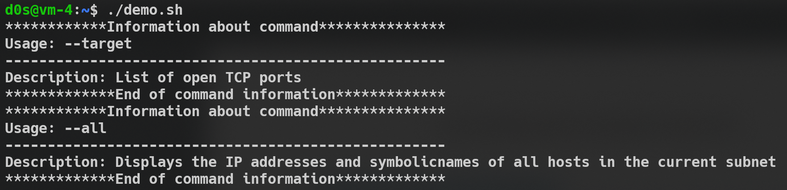
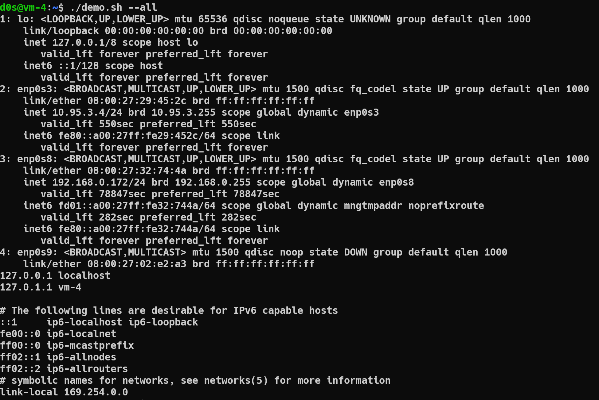
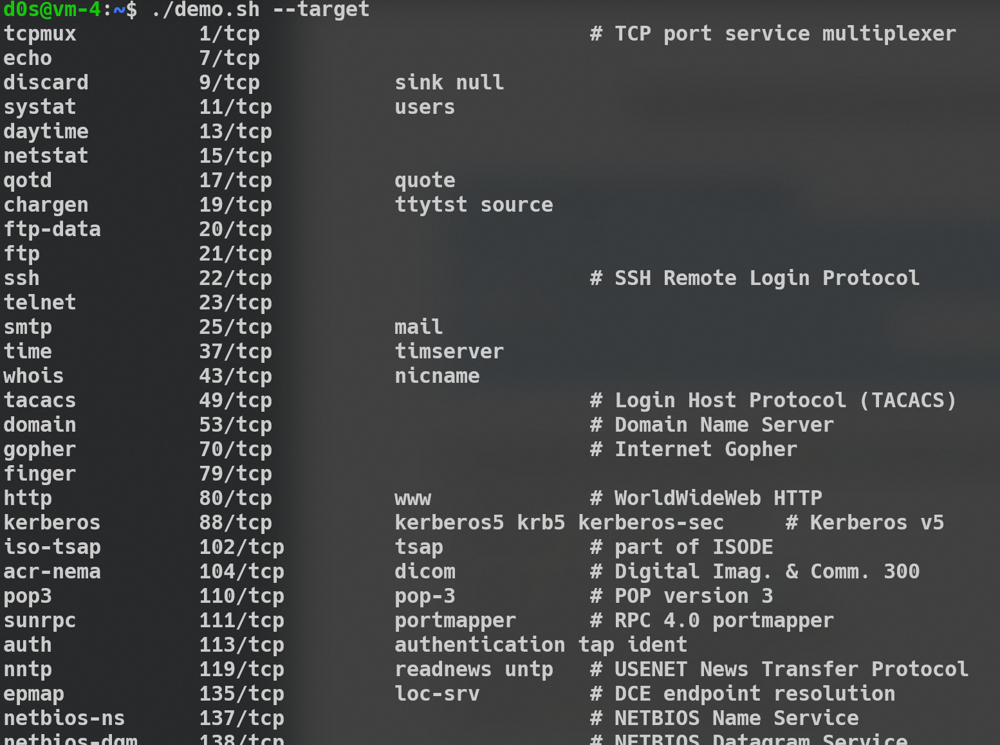

# A. Create a script that uses the following keys:

Script located with name **demo.sh**

## 1 
When starting without parameters, it will display a list of possible keys and their description.
For this we using the *display* function and hash table created in at the beginning of the script

## 2

The **--all** key displays the IP addresses and symbolic names of all hosts in the current subnet
Using *__all* funciton and bash command **cat** and **ip a**  

## 3 

The **--target** key displays a list of open system TCP ports
Using *__all* funciton and bash command **cat** and **grep**  

