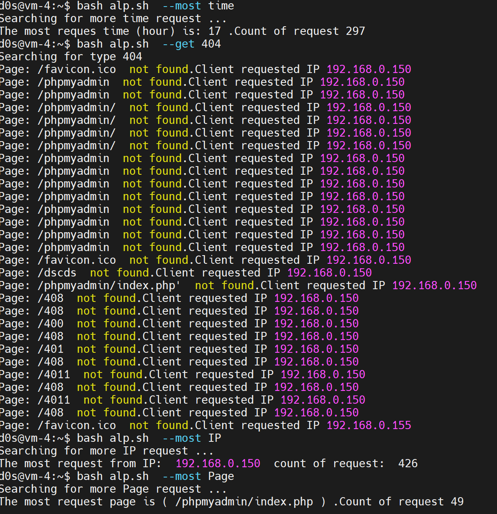
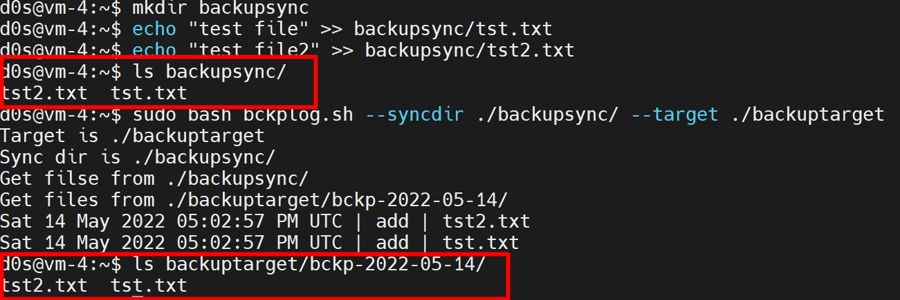
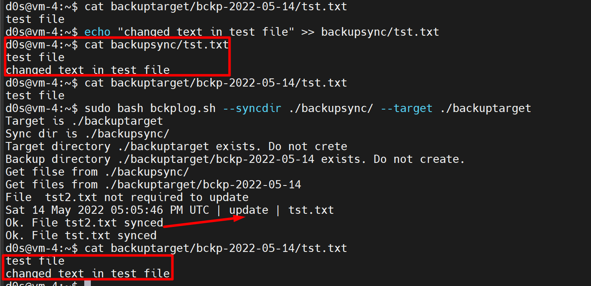
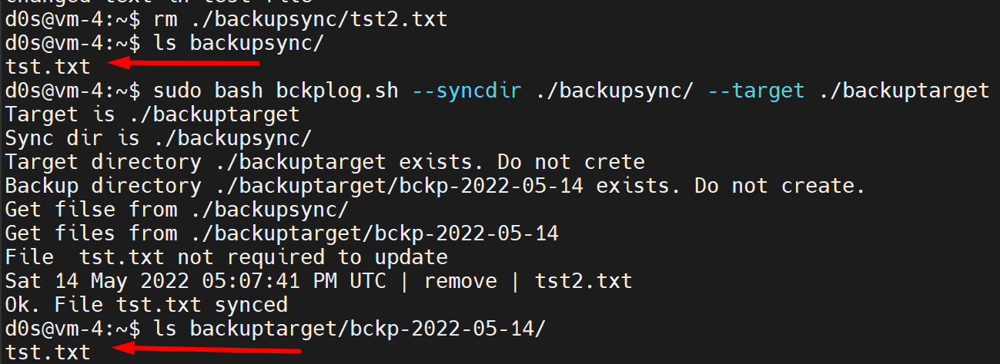
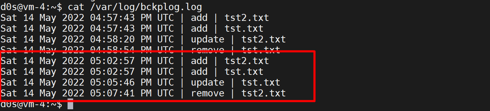
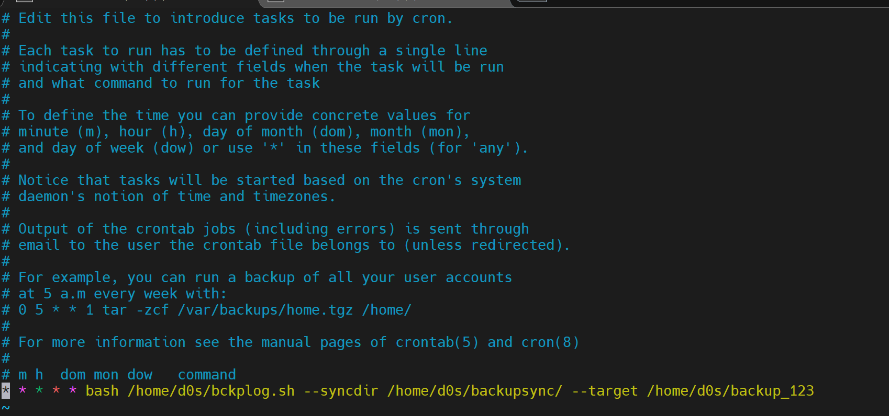
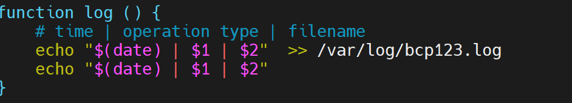
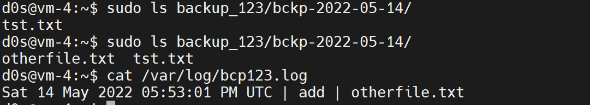

# A. Create a script that uses the following keys:

Script located with name **demo.sh**

## 1 
When starting without parameters, it will display a list of possible keys and their description.
For this we using the *display* function and hash table created in at the beginning of the script


## 2

The **--all** key displays the IP addresses and symbolic names of all hosts in the current subnet
Using *__all* funciton and bash command **cat** and **ip a**  


## 3 

The **--target** key displays a list of open system TCP ports
Using *__all* funciton and bash command **cat** and **grep**  


# B. Using Apache log example create a script to answer the following questions:

Script located with name **apl.sh**


## 1. From which ip were the most requests?

`bash alp.sh --most IP`

## 2. What is the most requested page?

`bash alp.sh --most Page`

## 3. How many requests were there from each ip?

`bash alp.sh --count IP`

## 4. What non-existent pages were clients referred to?

`bash alp.sh --get 404`

## 5. What time did site get the most requests?

`bash alp.sh --most time`

## 6. What search bots have accessed the site? (UA + IP)

`bash alp.sh --get bot`

Test result of some commads:



# C. Create a data backup script that takes the following data as parameters:

### Path to the syncing directory set with arg syncdir

### The path to the directory where the copies of the files will be stored sets with argumet target

Simple examles of using sript. 
Lets create directory with name **backupsync** and create there two file with name **tst.txt**, **tst2.txt**


Run our script with target directory **backuptarget** 

`sudo bash bckplog.sh --syncdir ./backupsync/ --target ./backuptarget
`

We recive  the next result: 



Changing the file contet and resync this:



Remove file adn resync this:



Log information writes to **/var/log/bckplog.log** :



Shedule script use the `sudo crontab -e` command:
and add next to end of file.
```
* * * * * bash /home/d0s/bckplog.sh --syncdir /home/d0s/backupsync/ --target /home/d0s/backup_123
```
> **_NOTE_** We chaged the directory output to show that script work in background 



> **_NOTE_** Also chaged the directory log output to show that script work in background 



File syncing!

