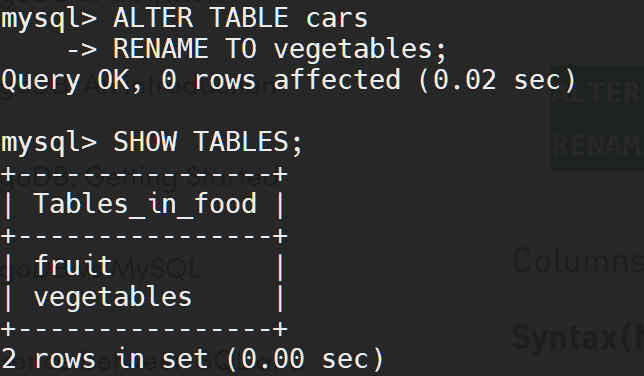
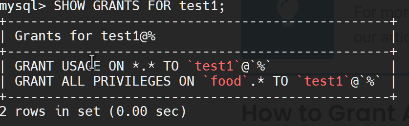

# Part 1

> 1. Download MySQL server for your OS on VM.
> 2. Install MySQL server on VM.

`apt install mysql-server`


For web intrface use the next command:

`apt-get install phpmyadmin php-mbstring php-mcrypt php-gettext`
`systemctl restart apache2.service`


Set password by command `mysql -u phpmyadmin - p` and login via web interface:


> 3. Select a subject area and describe the database schema, (minimum 3 tables)

Use the  `SHOW SCHEMAS; command`


- information_schema provides access to database metadata, information about the MySQL server such as the name of a database or table, the data type of a column, or access privileges. Other terms that are sometimes used for this information are data dictionary and system catalog.             
- performance_schema - focuses primarily on performance data. This differs from INFORMATION_SCHEMA, which serves for inspection of metadata. The Performance Schema monitors server events. An “event” is anything the server does that takes time and has been instrumented so that timing information can be collected. 


- sys   MySQL 8.0 includes the sys schema, a set of objects that helps DBAs and developers interpret data collected by the Performance Schema. sys schema objects can be used for typical tuning and diagnosis use cases. Objects in this schema include:

    * Views that summarize Performance Schema data into more easily understandable form.

    * Stored procedures that perform operations such as Performance Schema configuration and generating diagnostic reports.

    * Stored functions that query Performance Schema configuration and provide formatting services.             
- phpmyadmin        - the phpadmis system information tabable (created by p.2)  
> 4. Create a database on the server through the console.

For examle creating a food database:

```
CREATE DATABASE food;
```

> 5. Fill in tables.

```
 CREATE TABLE fruit (
    -> id INT NOT NULL AUTO_INCREMENT,
    -> name VARCHAR (100) NOT NULL,
    -> color VARCHAR (40) NOT NULL,
    -> country VARCHAR (40),
    -> city VARCHAR (100),
    -> count INT,
    -> updated_at DATE,
    -> PRIMARY KEY (id)
    -> );
```
Insert data to table:


```
INSERT INTO fruit (name,color,country,city,count,updated_at) VALUES ("strawberry","red","Ukraine","Kyiv","31","2022-06-01");

```
> 6. Construct and execute SELECT operator with WHERE, GROUP BY and ORDER BY.

Select all data `SELECT * FROM fruit`


Select all data `SELECT * FROM fruit WHERE updated_at < "2022-06-01";`


Gropped by country:
`SELECT *  FROM fruit ORDER BY country;`


For using the GROUP BY chage the sql mode:
```
SET sql_mode = ''

SELECT * FROM fruit GROUP BY color;
```


> 7. Execute other different SQL queries DDL, DML, DCL.

**DDL (Data Definition Language)**:

**CREATE**: This command is used to create the database or its objects (like table, index, function, views, store procedure, and triggers).


**DROP**: This command is used to delete objects from the database.


**ALTER**: This is used to alter the structure of the database.
**RENAME**: This is used to rename an object existing in the database




**DML(Data Manipulation Language):**

UPDATE: It is used to update existing data within a table.

```
UPDATE fruit SET city = "Dnipro" , count = "10" WHERE id = 4;

```

DELETE : It is used to delete records from a database table.

```
DELETE FROM fruit WHERE name = "pear";

```

And now we go the next table information:


**DCL (Data Control Language)**:
DCL includes commands such as GRANT and REVOKE which mainly deal with the rights, permissions, and other controls of the database system.

> **_NOTE_** To testing this we create a new user and give him access

Crate new user with name **test1**:


Grant him acces :


Check the permissons:



Revoke the all permissions:


Check the grants:


> 8. Create a database of new users with different privileges. Connect to the
database as a new user and verify that the privileges allow or deny certain
actions.

Create two user **t1** and **t2** , and grant to **t1** user full access to table with name *fruit* and give  **t2** user access to table with name  *vegetable* .


Connect via user **t1**:


Select and Insert examples:


But when we want to select from table *vegetable* we got the <span style="color:red"> *denied* </span>  error. 


Reconect with **t2** user:


> 9. Make a selection from the main table DB MySQL

For examle select  database users :


And privileges to tables:


# Part 2
> 10. Make backup of your database.

Use the command :

`sudo mysqldump -u root -p  food  > bkp_food.sql`

>11. Delete the table and/or part of the data in the table.

Deleting table and some info from table and check it:


> 12. Restore your database.

Use the command:
`sudo mysql -u root -p  food  < bkp_food.sql`

And check it:


> 13. Transfer your local database to RDS AWS.

In AWS we created a new instance db-1 mysql


Also we creted new vm :


In terminal we connected to our local database server (192.168.0.172 **vm-4**) and copy sql file to our AWS VM with name **vm-7**.

> **_WARNING_** Before doing this on our VM we need to has an internet and also we copied the *.pem* key access file from cloud VM **vm-7** to **vm-4** and grant acces to user only. 

In our case we got a command:


```
 scp -r -i aws-key-1.pem bkp_food.sql.gz ec2-user@ec2-3-68-195-235.eu-central-1.compute.amazonaws.com:bkp_food.sql.gz

```

and now we have this file in our cloud **vm-7**:


And now we copy backup of or DB (food) , to AWS:

> 14. Connect to your database.

Installing mysql to our cloud **vm-7**

```
sudo yum install mysql -y
```

Connect to our mysql instance (**db-1**), folowing command:

```
mysql -h db-1.cfqj0zcfrge5.eu-central-1.rds.amazonaws.com -P 3306 -u root -p
```

Create a null database with the same name (*food*):


And restore backup following command ` source bkp_food.sql`:


> 15. Execute SELECT operator similar step 6.

Verify that we have all data:

> also doing some *INSERT* command


> 16. Create the dump of your database.
For creation a new dump from AWS RDS use the next command:

```
mysqldump --databases food -h db-1.cfqj0zcfrge5.eu-central-1.rds.amazonaws.com -u root -p 3306 > new_dump.sql
```


# Part 3

Using the https://cloud.mongodb.com/ we crete a new database cluster and downloading the mongo DB shell to connect from Windows CMD (or Powershell):


> **_NOTE_** For mongosh can be work we unzip the download file foledr *bin/* to %windir%/System32 folder

```
mongosh "mongodb+srv://cluster0.cpikp.mongodb.net/myFirstDatabase" --apiVersion 1 --username root
```


> 17. Create a database. Use the use command to connect to a new database (If it
doesn't exist, Mongo will create it when you write to it).


``` 
use demo;
```


> 18. Create a collection. Use db.createCollection to create a collection. I'll leave the
subject up to you. Run show dbs and show collections to view your database and
collections.

```
 db.createCollection("fruit", { capped : true, size : 5242880, max : 5000 } );

```


> 19. Create some documents. Insert a couple of documents into your collection. I'll
leave the subject matter up to you, perhaps cars or hats.

Insert the one information to our collection:

```
db.fruit.insertOne({ name: "pear", count: 100, region: { country: "Ukraine", city: "Lviv"}});
```


Insert many:

```
db.fruit.insertMany([  { name: "banana", count: 200, region: { country: "Egypt", city: "Cairo"}},{ name: "apple", count: 23, region: { country: "Ukraine", city: "Lviv"}}, { name: "peach", count: 156, region: { country: "Turkey", city: "Istambul"}} ]);
```


> 20. Use find() to list documents out.

Find by name:


Or filter by region:


also we can find by ObjectID or list all collection:

