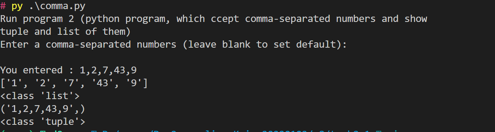
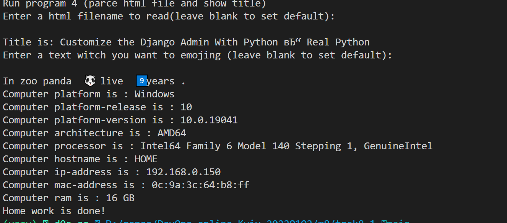

## Python easy programs

Create an virual environment

```
virtualenv env
source env/bin/activate
pip3 install -r requirements.txt

```


For Windows System

```
virtualenv env
.\env\Scripts\activate

pip3 install -r requirements.txt
```

Run one program by command:

```
py comma.py
```



To run all of porgram just run next command:

```
py task8_1.py gethomework
```


